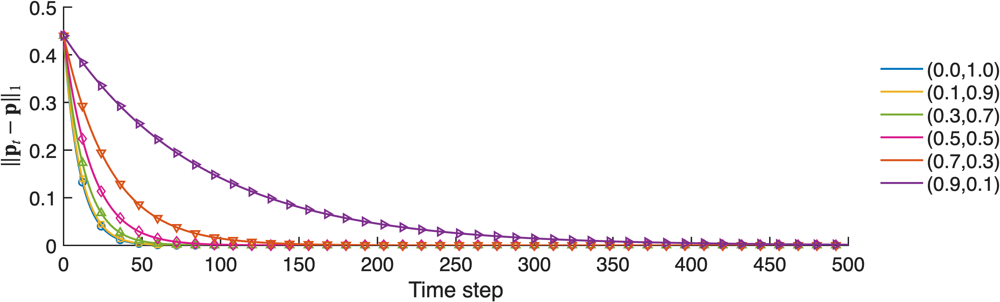
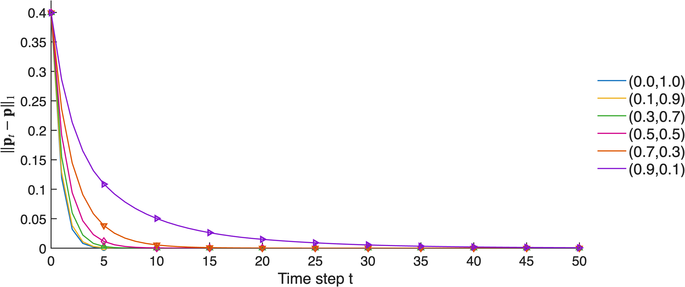

# hyperMERW: synthetic broadcasting and merging experiments

This folder contains the corrected MATLAB code, reproducible inputs, full transition tensors, and mixing curves for the synthetic experiments. The MovieLens experiment is maintained separately in the repository.

The corrected broadcasting matrix is recomputed here. It should replace the earlier displayed matrix when matching the manuscript to this release. See [manuscript consistency notes](MANUSCRIPT_CHECK.md) for the remaining matrix and topology discrepancies.

## Reproduce the results

Open this folder as the MATLAB Current Folder and run:

```matlab
run_all
```

This runs uniform broadcasting, non-uniform broadcasting, and merging, checks the saved results, and regenerates this README with the numerical results and all matrices. It writes only the generated files in this package, including this README. It does not read or overwrite the MovieLens files. The run was tested with MATLAB R2025b on Apple silicon. No additional toolbox or external dataset is required.

To run one experiment:

```matlab
addpath('broadcasting', 'merging')
demo_uniform_b       % Uniform k=3 broadcasting
demo_nonuniform_b    % Joint k=2,3 broadcasting, six weight pairs
demo_merge_plot      % Joint k=2,3 merging, including the pure k=3 endpoint
```

After rerunning individual experiments, use `verify_results` and `write_readme` to update the checks and documentation. Run `test_solvers` for additional small-problem regression tests. Output paths are relative to this package, not to a hard-coded computer directory.

## Files

| File | Purpose |
| --- | --- |
| `run_all.m` | Reproduce all synthetic results and regenerate the README |
| `broadcasting/demo_uniform_b.m` | Construct the broadcasting reference and print the uniform projected kernel |
| `broadcasting/demo_nonuniform_b.m` | Joint broadcasting weight sweep and mixing plot |
| `broadcasting/broadcast_sinkhorn_uniform_k3.m` | Corrected uniform broadcasting solver |
| `broadcasting/broadcast_sinkhorn_nonuniform_k23.m` | Corrected non-uniform broadcasting solver |
| `merging/demo_merge_plot.m` | Generate the seeded merging references, infer both layers, and plot mixing |
| `merging/merge_sinkhorn_uniform_k3.m` | Corrected uniform merging solver |
| `merging/merge_sinkhorn_nonuniform_k23.m` | Corrected joint merging solver |
| `merging/merge_map_k3.m` | Apply the nonlinear merging map |
| `verify_results.m` | Check normalization, stationarity, symmetry, allowed entries, scaling equations, and trajectories |
| `test_solvers.m` | Check additional small problems and invalid-input handling |
| `write_readme.m` | Generate the numerical sections below from the saved MAT files |
| `documentation/README_intro.md` | Editable introduction used by the README generator |
| `results/broadcast_uniform_corrected.mat` | Full uniform broadcasting result in `uniform_results` |
| `results/broadcast_results_corrected.mat` | Full broadcasting weight sweep in `results` |
| `results/merge_mixing_curves_corrected.mat` | Full merging weight sweep and inputs |
| `results/verification.mat` | Numerical verification report |

## Experimental setup

### Broadcasting

The eight within-group triples are

```text
{1,2,3}, {1,2,4}, {1,3,4}, {2,3,4},
{5,6,7}, {5,6,8}, {5,7,8}, {6,7,8}.
```

Each node in a triple broadcasts to the other two. The additional cross-group events are `4 -> {6,7}` and `6 -> {2,3}`. Both receiver orderings are stored, so the third-order reference is symmetric in its last two indices. No pivot is repeated among its receivers. There are 26 directed hyperedge events, represented by 52 nonzero ordered tensor entries.

The pairwise layer contains every directed edge within `{1,2,3,4}` and within `{5,6,7,8}`, including self-loops. It has 32 nonzero entries. References are normalized over the receiver modes. The prescribed distribution is

```matlab
p = [0.07; 0.07; 0.07; 0.07; 0.18; 0.18; 0.18; 0.18];
```

For non-uniform broadcasting, the two layers are inferred jointly for each weight pair. The constraint is on their **weighted combined pivot marginal**, not on each layer's row sum separately. Thus `P2 = B2` and `P3 = sum(B3,3)` are layer contributions. Their combination `P = lambda2*P2 + lambda3*P3` is row-stochastic and satisfies `P'*p = p`. Individual contributions need not be stochastic or preserve `p` separately.

The corrected receiver factors are

```text
K2(i,j)   = p(i)*A2(i,j)
K3(i,j,l) = p(i)*A3(i,j,l)
B2(i,j)   = K2(i,j)*u(i)*v(j)^p(i)
B3(i,j,l) = K3(i,j,l)*u(i)*v(j)^(p(i)/2)*v(l)^(p(i)/2)
```

The weights enter the objective and mixture constraints, not `K2` or `K3`. Pivot normalization is followed by sequential scalar receiver solves using the newest coordinates. The old simultaneous ratio update `v = v.*(p./eta)` is not used. The optimization objective is the layer-weighted sum of `B.*log(B./A)` on allowed entries. A zero-weight layer is excluded from optimization and returned as zero for bookkeeping.

### Merging

The merging experiment uses the seeded random reference arrays that produce the reported densities and transition matrix. **These are not the reversed broadcasting topology.** To reproduce these numbers, a manuscript description should identify the merging arrays supplied here, rather than state that the two experiments use the same hypergraph.

The demo uses `rng(1,'twister')`. It draws eight uniform random numbers, takes their square roots, and normalizes them to obtain `p`. It generates the third-order reference with Bernoulli probability 0.75, averages the two tail orderings, repairs empty receiver rows if needed, and normalizes each row. The pairwise reference comes from a directed proposal generated with probability 0.60 and an added directed cycle, followed by a Metropolis--Hastings correction targeting `p`. The full normalized references are saved, so their entry values as well as their zero patterns are reproducible.

There are 28 nonzero entries out of 64 in `A2` and 465 out of 512 in `A3`. Their ordered-entry densities are 0.4375 and 0.908203125. These are array-entry fractions, not fractions of distinct unordered hyperedges. Averaging the tail orderings can increase the fraction of nonzero entries beyond the initial sampling probability. Repeated tail indices are included in this array-based experiment.

The merging stationary vector shown to three decimal places in the manuscript is rounded. Use the full-precision vector saved with the experiment, rather than rebuilding it from the rounded display.

For positive weights the two transition layers are inferred jointly with a common receiver vector and separate pivot scalings:

```text
M2(i,j)   = A2(i,j)*R2(i)*v(j)^p(i)
M3(i,l,j) = A3(i,l,j)*R3(i,l)*v(j)^(p(i)*p(l))
```

Each merging layer is output-stochastic. Their combined map satisfies

```text
lambda2*M2'*p + lambda3*F_M3(p) = p
F_M3(q)(j) = sum_i sum_l M3(i,l,j)*q(i)*q(l)
```

The absorbed pivot scaling is `R = omega.*U`, with `K = omega.*A`. Receiver equations are solved in logarithmic coordinates. The implementation minimizes the layer-weighted sum of `M.*log(M./A)` on allowed entries. The `(0,1)` endpoint uses the uniform solver and has no inferred pairwise matrix, so `M2ByWeight{1}` is empty.

### Mixing curves and numerical checks

Both experiments use the weights

```matlab
W = [0 1; 0.1 0.9; 0.3 0.7; 0.5 0.5; 0.7 0.3; 0.9 0.1];
```

All curves within an experiment start from `p0 = ones(8,1)/8`, with the initial error recorded at `t=0`. Broadcasting runs for 500 steps with `p_next = P'*p_current`. Merging runs for 50 steps using the direct nonlinear map, with no damping. The merging demo only renormalizes floating-point mass drift after each step. Both figures use a linear error axis, and the merging markers are spaced every five steps.

Broadcasting uses outer tolerance `1e-13` and scalar marginal tolerance `1e-15`. Merging uses outer tolerance `1e-10` and scalar root tolerance `1e-13`. A demo stops with an error if its solver does not meet the requested tolerance. The checks also inspect the maximum row residual, not only the mean broadcasting row residual used by its stopping rule.

The merging sufficient contraction bound is `lambda2*delta2 + 2*lambda3*delta3`, where each `delta` is half the maximum L1 distance between two conditional output rows. A bound greater than or equal to one does not certify global contraction. It does not rule out the observed convergence from the stated initialization. The numerical checks are not a proof of convergence for arbitrary inputs.





## Load full-precision matrices

```matlab
s = load('results/broadcast_uniform_corrected.mat');
P_uniform = s.uniform_results.Pproj;
B3_uniform = s.uniform_results.B3;

s = load('results/broadcast_results_corrected.mat');
b = s.results;
q = find(all(abs(b.W-[0.5 0.5]) < 1e-12,2));
P_mixed = b.Pproj_all{q};
B2 = b.B2_all{q};
B3 = b.B3_all{q};

m = load('results/merge_mixing_curves_corrected.mat');
q = find(all(abs(m.W-[0.5 0.5]) < 1e-12,2));
M2 = m.M2ByWeight{q};
M3 = m.M3ByWeight{q};
M3_first_slice = M3(:,:,1);
```

All eight receiver slices are included below, not only the first three. The README prints six decimal places for readability. Very small positive entries may therefore display as zero. The MAT files retain double precision and are the authoritative source for computations. Tensor slices use MATLAB indexing `(:,:,j)`. Broadcasting slices have axes `(pivot, first receiver)` with the second receiver fixed. Merging slices have the two tails as axes with the receiver fixed.

The following sections are generated directly from the saved results by `write_readme.m`.


## Reproduced results

MATLAB version used for the saved run: `25.2.0.3042426 (R2025b) Update 1`.

### Broadcasting

| Weights (lambda2, lambda3) | Sweeps | Max row residual | Stationarity L1 | Spectral gap | L1 error at t=500 |
| --- | ---: | ---: | ---: | ---: | ---: |
| (0.0, 1.0) | 134 | 1.835e-13 | 2.365e-14 | 0.095153706 | 8.367e-13 |
| (0.1, 0.9) | 130 | 1.631e-13 | 2.115e-14 | 0.091285433 | 3.112e-12 |
| (0.3, 0.7) | 136 | 1.741e-13 | 1.657e-14 | 0.074974554 | 3.083e-12 |
| (0.5, 0.5) | 171 | 1.379e-13 | 1.044e-14 | 0.054970857 | 3.099e-13 |
| (0.7, 0.3) | 266 | 1.363e-13 | 7.022e-15 | 0.033492007 | 1.763e-08 |
| (0.9, 0.1) | 738 | 1.428e-13 | 3.830e-15 | 0.011271262 | 1.521e-03 |

The initial L1 error is 0.440000000000 for every broadcasting curve.

### Merging

| Weights (lambda2, lambda3) | Iterations | M2 max row residual | M3 max row residual | Stationarity L1 | Contraction bound | L1 error at t=50 |
| --- | ---: | ---: | ---: | ---: | ---: | ---: |
| (0.0, 1.0) | 11 | not active | 1.755e-11 | 2.109e-14 | 1.689073 | 1.160e-14 |
| (0.1, 0.9) | 28 | 5.645e-11 | 2.851e-12 | 1.112e-13 | 1.617879 | 1.024e-13 |
| (0.3, 0.7) | 65 | 7.684e-11 | 3.533e-12 | 2.430e-13 | 1.475734 | 2.876e-13 |
| (0.5, 0.5) | 127 | 8.819e-11 | 3.819e-12 | 2.641e-13 | 1.338500 | 4.570e-13 |
| (0.7, 0.3) | 266 | 9.667e-11 | 3.947e-12 | 2.167e-13 | 1.203865 | 6.384e-09 |
| (0.9, 0.1) | 941 | 9.836e-11 | 3.750e-12 | 1.196e-13 | 1.069305 | 7.232e-04 |

The initial L1 error is 0.399570245612 for every merging curve. None of these bounds is below one.

### Verification

All saved-result checks passed. The largest checked log-scaling residual is 6.384e-16 for broadcasting and 2.220e-16 for merging.

## Stationary distributions

```matlab
p_broadcast = [
 0.070000000000000 0.070000000000000 0.070000000000000 0.070000000000000 0.180000000000000 0.180000000000000 0.180000000000000 0.180000000000000;
];
```

```matlab
p_merge = [
 0.171683281353109 0.225638191771642 0.002843241347680 0.146181020453029 0.101846542695283 0.080786752399281 0.114738340751562 0.156282629228414;
];
```


## Main reported matrices

Uniform broadcasting projected kernel:

```matlab
P_uniform = [
 0.000000 0.327533 0.327533 0.344934 0.000000 0.000000 0.000000 0.000000;
 0.364286 0.000000 0.308180 0.327533 0.000000 0.000000 0.000000 0.000000;
 0.364286 0.308180 0.000000 0.327533 0.000000 0.000000 0.000000 0.000000;
 0.271427 0.231732 0.231732 0.000000 0.000000 0.132555 0.132555 0.000000;
 0.000000 0.000000 0.000000 0.000000 0.000000 0.318601 0.330961 0.350438;
 0.000000 0.051549 0.051549 0.000000 0.305186 0.000000 0.286529 0.305186;
 0.000000 0.000000 0.000000 0.000000 0.344376 0.311249 0.000000 0.344376;
 0.000000 0.000000 0.000000 0.000000 0.350438 0.318601 0.330961 0.000000;
];
```


Merging pairwise transition matrix at (lambda2,lambda3)=(0.5,0.5):

```matlab
M2 = [
 0.574550 0.306236 0.000000 0.000000 0.000000 0.014896 0.000000 0.104319;
 0.202651 0.771254 0.000000 0.026095 0.000000 0.000000 0.000000 0.000000;
 0.000000 0.176314 0.484658 0.000000 0.170507 0.000000 0.168521 0.000000;
 0.000000 0.248886 0.000000 0.509348 0.035415 0.039143 0.000000 0.167207;
 0.000000 0.000000 0.000000 0.243836 0.756164 0.000000 0.000000 0.000000;
 0.293803 0.000000 0.000000 0.194945 0.000000 0.511252 0.000000 0.000000;
 0.000000 0.000000 0.000000 0.000000 0.000000 0.000000 1.000000 0.000000;
 0.222831 0.000000 0.000000 0.075080 0.000000 0.000000 0.000000 0.702089;
];
```


## Full adjacency/reference arrays

These are the normalized reference arrays used by the solvers. Their positive entries define the adjacency.

<details>
<summary>Broadcasting: A2 and all eight A3 slices</summary>

```matlab
A2_broadcast = [
 0.250000 0.250000 0.250000 0.250000 0.000000 0.000000 0.000000 0.000000;
 0.250000 0.250000 0.250000 0.250000 0.000000 0.000000 0.000000 0.000000;
 0.250000 0.250000 0.250000 0.250000 0.000000 0.000000 0.000000 0.000000;
 0.250000 0.250000 0.250000 0.250000 0.000000 0.000000 0.000000 0.000000;
 0.000000 0.000000 0.000000 0.000000 0.250000 0.250000 0.250000 0.250000;
 0.000000 0.000000 0.000000 0.000000 0.250000 0.250000 0.250000 0.250000;
 0.000000 0.000000 0.000000 0.000000 0.250000 0.250000 0.250000 0.250000;
 0.000000 0.000000 0.000000 0.000000 0.250000 0.250000 0.250000 0.250000;
];
```

```matlab
A3_broadcast(:,:,1) = [
 0.000000 0.000000 0.000000 0.000000 0.000000 0.000000 0.000000 0.000000;
 0.000000 0.000000 0.166667 0.166667 0.000000 0.000000 0.000000 0.000000;
 0.000000 0.166667 0.000000 0.166667 0.000000 0.000000 0.000000 0.000000;
 0.000000 0.125000 0.125000 0.000000 0.000000 0.000000 0.000000 0.000000;
 0.000000 0.000000 0.000000 0.000000 0.000000 0.000000 0.000000 0.000000;
 0.000000 0.000000 0.000000 0.000000 0.000000 0.000000 0.000000 0.000000;
 0.000000 0.000000 0.000000 0.000000 0.000000 0.000000 0.000000 0.000000;
 0.000000 0.000000 0.000000 0.000000 0.000000 0.000000 0.000000 0.000000;
];
```

```matlab
A3_broadcast(:,:,2) = [
 0.000000 0.000000 0.166667 0.166667 0.000000 0.000000 0.000000 0.000000;
 0.000000 0.000000 0.000000 0.000000 0.000000 0.000000 0.000000 0.000000;
 0.166667 0.000000 0.000000 0.166667 0.000000 0.000000 0.000000 0.000000;
 0.125000 0.000000 0.125000 0.000000 0.000000 0.000000 0.000000 0.000000;
 0.000000 0.000000 0.000000 0.000000 0.000000 0.000000 0.000000 0.000000;
 0.000000 0.000000 0.125000 0.000000 0.000000 0.000000 0.000000 0.000000;
 0.000000 0.000000 0.000000 0.000000 0.000000 0.000000 0.000000 0.000000;
 0.000000 0.000000 0.000000 0.000000 0.000000 0.000000 0.000000 0.000000;
];
```

```matlab
A3_broadcast(:,:,3) = [
 0.000000 0.166667 0.000000 0.166667 0.000000 0.000000 0.000000 0.000000;
 0.166667 0.000000 0.000000 0.166667 0.000000 0.000000 0.000000 0.000000;
 0.000000 0.000000 0.000000 0.000000 0.000000 0.000000 0.000000 0.000000;
 0.125000 0.125000 0.000000 0.000000 0.000000 0.000000 0.000000 0.000000;
 0.000000 0.000000 0.000000 0.000000 0.000000 0.000000 0.000000 0.000000;
 0.000000 0.125000 0.000000 0.000000 0.000000 0.000000 0.000000 0.000000;
 0.000000 0.000000 0.000000 0.000000 0.000000 0.000000 0.000000 0.000000;
 0.000000 0.000000 0.000000 0.000000 0.000000 0.000000 0.000000 0.000000;
];
```

```matlab
A3_broadcast(:,:,4) = [
 0.000000 0.166667 0.166667 0.000000 0.000000 0.000000 0.000000 0.000000;
 0.166667 0.000000 0.166667 0.000000 0.000000 0.000000 0.000000 0.000000;
 0.166667 0.166667 0.000000 0.000000 0.000000 0.000000 0.000000 0.000000;
 0.000000 0.000000 0.000000 0.000000 0.000000 0.000000 0.000000 0.000000;
 0.000000 0.000000 0.000000 0.000000 0.000000 0.000000 0.000000 0.000000;
 0.000000 0.000000 0.000000 0.000000 0.000000 0.000000 0.000000 0.000000;
 0.000000 0.000000 0.000000 0.000000 0.000000 0.000000 0.000000 0.000000;
 0.000000 0.000000 0.000000 0.000000 0.000000 0.000000 0.000000 0.000000;
];
```

```matlab
A3_broadcast(:,:,5) = [
 0.000000 0.000000 0.000000 0.000000 0.000000 0.000000 0.000000 0.000000;
 0.000000 0.000000 0.000000 0.000000 0.000000 0.000000 0.000000 0.000000;
 0.000000 0.000000 0.000000 0.000000 0.000000 0.000000 0.000000 0.000000;
 0.000000 0.000000 0.000000 0.000000 0.000000 0.000000 0.000000 0.000000;
 0.000000 0.000000 0.000000 0.000000 0.000000 0.000000 0.000000 0.000000;
 0.000000 0.000000 0.000000 0.000000 0.000000 0.000000 0.125000 0.125000;
 0.000000 0.000000 0.000000 0.000000 0.000000 0.166667 0.000000 0.166667;
 0.000000 0.000000 0.000000 0.000000 0.000000 0.166667 0.166667 0.000000;
];
```

```matlab
A3_broadcast(:,:,6) = [
 0.000000 0.000000 0.000000 0.000000 0.000000 0.000000 0.000000 0.000000;
 0.000000 0.000000 0.000000 0.000000 0.000000 0.000000 0.000000 0.000000;
 0.000000 0.000000 0.000000 0.000000 0.000000 0.000000 0.000000 0.000000;
 0.000000 0.000000 0.000000 0.000000 0.000000 0.000000 0.125000 0.000000;
 0.000000 0.000000 0.000000 0.000000 0.000000 0.000000 0.166667 0.166667;
 0.000000 0.000000 0.000000 0.000000 0.000000 0.000000 0.000000 0.000000;
 0.000000 0.000000 0.000000 0.000000 0.166667 0.000000 0.000000 0.166667;
 0.000000 0.000000 0.000000 0.000000 0.166667 0.000000 0.166667 0.000000;
];
```

```matlab
A3_broadcast(:,:,7) = [
 0.000000 0.000000 0.000000 0.000000 0.000000 0.000000 0.000000 0.000000;
 0.000000 0.000000 0.000000 0.000000 0.000000 0.000000 0.000000 0.000000;
 0.000000 0.000000 0.000000 0.000000 0.000000 0.000000 0.000000 0.000000;
 0.000000 0.000000 0.000000 0.000000 0.000000 0.125000 0.000000 0.000000;
 0.000000 0.000000 0.000000 0.000000 0.000000 0.166667 0.000000 0.166667;
 0.000000 0.000000 0.000000 0.000000 0.125000 0.000000 0.000000 0.125000;
 0.000000 0.000000 0.000000 0.000000 0.000000 0.000000 0.000000 0.000000;
 0.000000 0.000000 0.000000 0.000000 0.166667 0.166667 0.000000 0.000000;
];
```

```matlab
A3_broadcast(:,:,8) = [
 0.000000 0.000000 0.000000 0.000000 0.000000 0.000000 0.000000 0.000000;
 0.000000 0.000000 0.000000 0.000000 0.000000 0.000000 0.000000 0.000000;
 0.000000 0.000000 0.000000 0.000000 0.000000 0.000000 0.000000 0.000000;
 0.000000 0.000000 0.000000 0.000000 0.000000 0.000000 0.000000 0.000000;
 0.000000 0.000000 0.000000 0.000000 0.000000 0.166667 0.166667 0.000000;
 0.000000 0.000000 0.000000 0.000000 0.125000 0.000000 0.125000 0.000000;
 0.000000 0.000000 0.000000 0.000000 0.166667 0.166667 0.000000 0.000000;
 0.000000 0.000000 0.000000 0.000000 0.000000 0.000000 0.000000 0.000000;
];
```

</details>

<details>
<summary>Merging: A2 and all eight A3 slices</summary>

```matlab
A2_merge = [
 0.515863 0.262854 0.000000 0.000000 0.000000 0.078426 0.000000 0.142857;
 0.200000 0.717443 0.001575 0.080982 0.000000 0.000000 0.000000 0.000000;
 0.000000 0.125000 0.625000 0.000000 0.125000 0.000000 0.125000 0.000000;
 0.000000 0.125000 0.000000 0.558361 0.099531 0.092108 0.000000 0.125000;
 0.000000 0.000000 0.003490 0.142857 0.853653 0.000000 0.000000 0.000000;
 0.166667 0.000000 0.000000 0.166667 0.000000 0.666667 0.000000 0.000000;
 0.000000 0.000000 0.003098 0.000000 0.000000 0.000000 0.996902 0.000000;
 0.156935 0.000000 0.000000 0.116920 0.000000 0.000000 0.000000 0.726145;
];
```

```matlab
A3_merge(:,:,1) = [
 0.142857 0.181818 0.000000 0.000000 0.000000 0.142857 0.133333 0.083333;
 0.181818 0.000000 0.142857 0.000000 0.090909 0.166667 0.090909 0.090909;
 0.000000 0.142857 0.166667 0.166667 0.090909 0.153846 0.166667 0.200000;
 0.000000 0.000000 0.166667 0.250000 0.076923 0.181818 0.100000 0.166667;
 0.000000 0.090909 0.090909 0.076923 0.200000 0.181818 0.142857 0.142857;
 0.142857 0.166667 0.153846 0.181818 0.181818 0.125000 0.090909 0.090909;
 0.133333 0.090909 0.166667 0.100000 0.142857 0.090909 0.250000 0.153846;
 0.083333 0.090909 0.200000 0.166667 0.142857 0.090909 0.153846 0.142857;
];
```

```matlab
A3_merge(:,:,2) = [
 0.142857 0.090909 0.090909 0.181818 0.166667 0.142857 0.133333 0.166667;
 0.090909 0.250000 0.142857 0.090909 0.181818 0.166667 0.090909 0.181818;
 0.090909 0.142857 0.166667 0.083333 0.090909 0.153846 0.083333 0.100000;
 0.181818 0.090909 0.083333 0.000000 0.153846 0.090909 0.100000 0.083333;
 0.166667 0.181818 0.090909 0.153846 0.200000 0.181818 0.142857 0.142857;
 0.142857 0.166667 0.153846 0.090909 0.181818 0.125000 0.181818 0.090909;
 0.133333 0.090909 0.083333 0.100000 0.142857 0.181818 0.250000 0.153846;
 0.166667 0.181818 0.100000 0.083333 0.142857 0.090909 0.153846 0.142857;
];
```

```matlab
A3_merge(:,:,3) = [
 0.142857 0.181818 0.090909 0.090909 0.166667 0.142857 0.133333 0.166667;
 0.181818 0.000000 0.142857 0.181818 0.090909 0.166667 0.181818 0.090909;
 0.090909 0.142857 0.166667 0.083333 0.181818 0.153846 0.166667 0.000000;
 0.090909 0.181818 0.083333 0.250000 0.153846 0.181818 0.100000 0.166667;
 0.166667 0.090909 0.181818 0.153846 0.000000 0.090909 0.142857 0.142857;
 0.142857 0.166667 0.153846 0.181818 0.090909 0.125000 0.090909 0.000000;
 0.133333 0.181818 0.166667 0.100000 0.142857 0.090909 0.250000 0.076923;
 0.166667 0.090909 0.000000 0.166667 0.142857 0.000000 0.076923 0.142857;
];
```

```matlab
A3_merge(:,:,4) = [
 0.142857 0.181818 0.181818 0.181818 0.083333 0.071429 0.066667 0.166667;
 0.181818 0.250000 0.071429 0.090909 0.090909 0.166667 0.181818 0.090909;
 0.181818 0.071429 0.166667 0.083333 0.090909 0.153846 0.166667 0.100000;
 0.181818 0.090909 0.083333 0.000000 0.076923 0.181818 0.100000 0.166667;
 0.083333 0.090909 0.090909 0.076923 0.200000 0.181818 0.071429 0.071429;
 0.071429 0.166667 0.153846 0.181818 0.181818 0.125000 0.181818 0.181818;
 0.066667 0.181818 0.166667 0.100000 0.071429 0.181818 0.250000 0.153846;
 0.166667 0.090909 0.100000 0.166667 0.071429 0.181818 0.153846 0.142857;
];
```

```matlab
A3_merge(:,:,5) = [
 0.142857 0.000000 0.181818 0.181818 0.166667 0.142857 0.133333 0.083333;
 0.000000 0.250000 0.142857 0.181818 0.181818 0.000000 0.090909 0.181818;
 0.181818 0.142857 0.166667 0.166667 0.181818 0.076923 0.083333 0.200000;
 0.181818 0.181818 0.166667 0.000000 0.153846 0.000000 0.200000 0.083333;
 0.166667 0.181818 0.181818 0.153846 0.000000 0.090909 0.142857 0.142857;
 0.142857 0.000000 0.076923 0.000000 0.090909 0.125000 0.090909 0.181818;
 0.133333 0.090909 0.083333 0.200000 0.142857 0.090909 0.000000 0.076923;
 0.083333 0.181818 0.200000 0.083333 0.142857 0.181818 0.076923 0.142857;
];
```

```matlab
A3_merge(:,:,6) = [
 0.000000 0.090909 0.090909 0.090909 0.166667 0.142857 0.133333 0.083333;
 0.090909 0.000000 0.142857 0.181818 0.090909 0.000000 0.090909 0.181818;
 0.090909 0.142857 0.166667 0.166667 0.090909 0.153846 0.083333 0.100000;
 0.090909 0.181818 0.166667 0.000000 0.153846 0.181818 0.100000 0.083333;
 0.166667 0.090909 0.090909 0.153846 0.000000 0.181818 0.142857 0.142857;
 0.142857 0.000000 0.153846 0.181818 0.181818 0.125000 0.181818 0.181818;
 0.133333 0.090909 0.083333 0.100000 0.142857 0.181818 0.000000 0.076923;
 0.083333 0.181818 0.100000 0.083333 0.142857 0.181818 0.076923 0.142857;
];
```

```matlab
A3_merge(:,:,7) = [
 0.142857 0.090909 0.181818 0.181818 0.083333 0.071429 0.133333 0.083333;
 0.090909 0.250000 0.142857 0.090909 0.181818 0.166667 0.181818 0.000000;
 0.181818 0.142857 0.000000 0.166667 0.181818 0.000000 0.083333 0.200000;
 0.181818 0.090909 0.166667 0.250000 0.153846 0.090909 0.200000 0.083333;
 0.083333 0.181818 0.181818 0.153846 0.200000 0.000000 0.142857 0.142857;
 0.071429 0.166667 0.000000 0.090909 0.000000 0.125000 0.000000 0.181818;
 0.133333 0.181818 0.083333 0.200000 0.142857 0.000000 0.000000 0.153846;
 0.083333 0.000000 0.200000 0.083333 0.142857 0.181818 0.153846 0.142857;
];
```

```matlab
A3_merge(:,:,8) = [
 0.142857 0.181818 0.181818 0.090909 0.166667 0.142857 0.133333 0.166667;
 0.181818 0.000000 0.071429 0.181818 0.090909 0.166667 0.090909 0.181818;
 0.181818 0.071429 0.000000 0.083333 0.090909 0.153846 0.166667 0.100000;
 0.090909 0.181818 0.083333 0.250000 0.076923 0.090909 0.100000 0.166667;
 0.166667 0.090909 0.090909 0.076923 0.200000 0.090909 0.071429 0.071429;
 0.142857 0.166667 0.153846 0.090909 0.090909 0.125000 0.181818 0.090909;
 0.133333 0.090909 0.166667 0.100000 0.071429 0.181818 0.000000 0.153846;
 0.166667 0.181818 0.100000 0.166667 0.071429 0.090909 0.153846 0.000000;
];
```

</details>


## Full broadcasting transition tensors

<details>
<summary>Uniform k=3: all eight B3 slices</summary>

```matlab
B3_uniform(:,:,1) = [
 0.000000 0.000000 0.000000 0.000000 0.000000 0.000000 0.000000 0.000000;
 0.000000 0.000000 0.172467 0.191820 0.000000 0.000000 0.000000 0.000000;
 0.000000 0.172467 0.000000 0.191820 0.000000 0.000000 0.000000 0.000000;
 0.000000 0.135714 0.135714 0.000000 0.000000 0.000000 0.000000 0.000000;
 0.000000 0.000000 0.000000 0.000000 0.000000 0.000000 0.000000 0.000000;
 0.000000 0.000000 0.000000 0.000000 0.000000 0.000000 0.000000 0.000000;
 0.000000 0.000000 0.000000 0.000000 0.000000 0.000000 0.000000 0.000000;
 0.000000 0.000000 0.000000 0.000000 0.000000 0.000000 0.000000 0.000000;
];
```

```matlab
B3_uniform(:,:,2) = [
 0.000000 0.000000 0.155066 0.172467 0.000000 0.000000 0.000000 0.000000;
 0.000000 0.000000 0.000000 0.000000 0.000000 0.000000 0.000000 0.000000;
 0.172467 0.000000 0.000000 0.135714 0.000000 0.000000 0.000000 0.000000;
 0.135714 0.000000 0.096018 0.000000 0.000000 0.000000 0.000000 0.000000;
 0.000000 0.000000 0.000000 0.000000 0.000000 0.000000 0.000000 0.000000;
 0.000000 0.000000 0.051549 0.000000 0.000000 0.000000 0.000000 0.000000;
 0.000000 0.000000 0.000000 0.000000 0.000000 0.000000 0.000000 0.000000;
 0.000000 0.000000 0.000000 0.000000 0.000000 0.000000 0.000000 0.000000;
];
```

```matlab
B3_uniform(:,:,3) = [
 0.000000 0.155066 0.000000 0.172467 0.000000 0.000000 0.000000 0.000000;
 0.172467 0.000000 0.000000 0.135714 0.000000 0.000000 0.000000 0.000000;
 0.000000 0.000000 0.000000 0.000000 0.000000 0.000000 0.000000 0.000000;
 0.135714 0.096018 0.000000 0.000000 0.000000 0.000000 0.000000 0.000000;
 0.000000 0.000000 0.000000 0.000000 0.000000 0.000000 0.000000 0.000000;
 0.000000 0.051549 0.000000 0.000000 0.000000 0.000000 0.000000 0.000000;
 0.000000 0.000000 0.000000 0.000000 0.000000 0.000000 0.000000 0.000000;
 0.000000 0.000000 0.000000 0.000000 0.000000 0.000000 0.000000 0.000000;
];
```

```matlab
B3_uniform(:,:,4) = [
 0.000000 0.172467 0.172467 0.000000 0.000000 0.000000 0.000000 0.000000;
 0.191820 0.000000 0.135714 0.000000 0.000000 0.000000 0.000000 0.000000;
 0.191820 0.135714 0.000000 0.000000 0.000000 0.000000 0.000000 0.000000;
 0.000000 0.000000 0.000000 0.000000 0.000000 0.000000 0.000000 0.000000;
 0.000000 0.000000 0.000000 0.000000 0.000000 0.000000 0.000000 0.000000;
 0.000000 0.000000 0.000000 0.000000 0.000000 0.000000 0.000000 0.000000;
 0.000000 0.000000 0.000000 0.000000 0.000000 0.000000 0.000000 0.000000;
 0.000000 0.000000 0.000000 0.000000 0.000000 0.000000 0.000000 0.000000;
];
```

```matlab
B3_uniform(:,:,5) = [
 0.000000 0.000000 0.000000 0.000000 0.000000 0.000000 0.000000 0.000000;
 0.000000 0.000000 0.000000 0.000000 0.000000 0.000000 0.000000 0.000000;
 0.000000 0.000000 0.000000 0.000000 0.000000 0.000000 0.000000 0.000000;
 0.000000 0.000000 0.000000 0.000000 0.000000 0.000000 0.000000 0.000000;
 0.000000 0.000000 0.000000 0.000000 0.000000 0.000000 0.000000 0.000000;
 0.000000 0.000000 0.000000 0.000000 0.000000 0.000000 0.143265 0.161922;
 0.000000 0.000000 0.000000 0.000000 0.000000 0.155624 0.000000 0.188751;
 0.000000 0.000000 0.000000 0.000000 0.000000 0.169039 0.181399 0.000000;
];
```

```matlab
B3_uniform(:,:,6) = [
 0.000000 0.000000 0.000000 0.000000 0.000000 0.000000 0.000000 0.000000;
 0.000000 0.000000 0.000000 0.000000 0.000000 0.000000 0.000000 0.000000;
 0.000000 0.000000 0.000000 0.000000 0.000000 0.000000 0.000000 0.000000;
 0.000000 0.000000 0.000000 0.000000 0.000000 0.000000 0.132555 0.000000;
 0.000000 0.000000 0.000000 0.000000 0.000000 0.000000 0.149562 0.169039;
 0.000000 0.000000 0.000000 0.000000 0.000000 0.000000 0.000000 0.000000;
 0.000000 0.000000 0.000000 0.000000 0.155624 0.000000 0.000000 0.155624;
 0.000000 0.000000 0.000000 0.000000 0.169039 0.000000 0.149562 0.000000;
];
```

```matlab
B3_uniform(:,:,7) = [
 0.000000 0.000000 0.000000 0.000000 0.000000 0.000000 0.000000 0.000000;
 0.000000 0.000000 0.000000 0.000000 0.000000 0.000000 0.000000 0.000000;
 0.000000 0.000000 0.000000 0.000000 0.000000 0.000000 0.000000 0.000000;
 0.000000 0.000000 0.000000 0.000000 0.000000 0.132555 0.000000 0.000000;
 0.000000 0.000000 0.000000 0.000000 0.000000 0.149562 0.000000 0.181399;
 0.000000 0.000000 0.000000 0.000000 0.143265 0.000000 0.000000 0.143265;
 0.000000 0.000000 0.000000 0.000000 0.000000 0.000000 0.000000 0.000000;
 0.000000 0.000000 0.000000 0.000000 0.181399 0.149562 0.000000 0.000000;
];
```

```matlab
B3_uniform(:,:,8) = [
 0.000000 0.000000 0.000000 0.000000 0.000000 0.000000 0.000000 0.000000;
 0.000000 0.000000 0.000000 0.000000 0.000000 0.000000 0.000000 0.000000;
 0.000000 0.000000 0.000000 0.000000 0.000000 0.000000 0.000000 0.000000;
 0.000000 0.000000 0.000000 0.000000 0.000000 0.000000 0.000000 0.000000;
 0.000000 0.000000 0.000000 0.000000 0.000000 0.169039 0.181399 0.000000;
 0.000000 0.000000 0.000000 0.000000 0.161922 0.000000 0.143265 0.000000;
 0.000000 0.000000 0.000000 0.000000 0.188751 0.155624 0.000000 0.000000;
 0.000000 0.000000 0.000000 0.000000 0.000000 0.000000 0.000000 0.000000;
];
```

</details>

<details>
<summary>Weights (0.0, 1.0): P, layer contributions, and every B3 slice</summary>

```matlab
P = [
 0.000000 0.327533 0.327533 0.344934 0.000000 0.000000 0.000000 0.000000;
 0.364286 0.000000 0.308180 0.327533 0.000000 0.000000 0.000000 0.000000;
 0.364286 0.308180 0.000000 0.327533 0.000000 0.000000 0.000000 0.000000;
 0.271427 0.231732 0.231732 0.000000 0.000000 0.132555 0.132555 0.000000;
 0.000000 0.000000 0.000000 0.000000 0.000000 0.318601 0.330961 0.350438;
 0.000000 0.051549 0.051549 0.000000 0.305186 0.000000 0.286529 0.305186;
 0.000000 0.000000 0.000000 0.000000 0.344376 0.311249 0.000000 0.344376;
 0.000000 0.000000 0.000000 0.000000 0.350438 0.318601 0.330961 0.000000;
];
```

The k=2 layer is inactive. Its stored zero array is only bookkeeping.

```matlab
P3 = [
 0.000000 0.327533 0.327533 0.344934 0.000000 0.000000 0.000000 0.000000;
 0.364286 0.000000 0.308180 0.327533 0.000000 0.000000 0.000000 0.000000;
 0.364286 0.308180 0.000000 0.327533 0.000000 0.000000 0.000000 0.000000;
 0.271427 0.231732 0.231732 0.000000 0.000000 0.132555 0.132555 0.000000;
 0.000000 0.000000 0.000000 0.000000 0.000000 0.318601 0.330961 0.350438;
 0.000000 0.051549 0.051549 0.000000 0.305186 0.000000 0.286529 0.305186;
 0.000000 0.000000 0.000000 0.000000 0.344376 0.311249 0.000000 0.344376;
 0.000000 0.000000 0.000000 0.000000 0.350438 0.318601 0.330961 0.000000;
];
```

```matlab
B3(:,:,1) = [
 0.000000 0.000000 0.000000 0.000000 0.000000 0.000000 0.000000 0.000000;
 0.000000 0.000000 0.172467 0.191820 0.000000 0.000000 0.000000 0.000000;
 0.000000 0.172467 0.000000 0.191820 0.000000 0.000000 0.000000 0.000000;
 0.000000 0.135714 0.135714 0.000000 0.000000 0.000000 0.000000 0.000000;
 0.000000 0.000000 0.000000 0.000000 0.000000 0.000000 0.000000 0.000000;
 0.000000 0.000000 0.000000 0.000000 0.000000 0.000000 0.000000 0.000000;
 0.000000 0.000000 0.000000 0.000000 0.000000 0.000000 0.000000 0.000000;
 0.000000 0.000000 0.000000 0.000000 0.000000 0.000000 0.000000 0.000000;
];
```

```matlab
B3(:,:,2) = [
 0.000000 0.000000 0.155066 0.172467 0.000000 0.000000 0.000000 0.000000;
 0.000000 0.000000 0.000000 0.000000 0.000000 0.000000 0.000000 0.000000;
 0.172467 0.000000 0.000000 0.135714 0.000000 0.000000 0.000000 0.000000;
 0.135714 0.000000 0.096018 0.000000 0.000000 0.000000 0.000000 0.000000;
 0.000000 0.000000 0.000000 0.000000 0.000000 0.000000 0.000000 0.000000;
 0.000000 0.000000 0.051549 0.000000 0.000000 0.000000 0.000000 0.000000;
 0.000000 0.000000 0.000000 0.000000 0.000000 0.000000 0.000000 0.000000;
 0.000000 0.000000 0.000000 0.000000 0.000000 0.000000 0.000000 0.000000;
];
```

```matlab
B3(:,:,3) = [
 0.000000 0.155066 0.000000 0.172467 0.000000 0.000000 0.000000 0.000000;
 0.172467 0.000000 0.000000 0.135714 0.000000 0.000000 0.000000 0.000000;
 0.000000 0.000000 0.000000 0.000000 0.000000 0.000000 0.000000 0.000000;
 0.135714 0.096018 0.000000 0.000000 0.000000 0.000000 0.000000 0.000000;
 0.000000 0.000000 0.000000 0.000000 0.000000 0.000000 0.000000 0.000000;
 0.000000 0.051549 0.000000 0.000000 0.000000 0.000000 0.000000 0.000000;
 0.000000 0.000000 0.000000 0.000000 0.000000 0.000000 0.000000 0.000000;
 0.000000 0.000000 0.000000 0.000000 0.000000 0.000000 0.000000 0.000000;
];
```

```matlab
B3(:,:,4) = [
 0.000000 0.172467 0.172467 0.000000 0.000000 0.000000 0.000000 0.000000;
 0.191820 0.000000 0.135714 0.000000 0.000000 0.000000 0.000000 0.000000;
 0.191820 0.135714 0.000000 0.000000 0.000000 0.000000 0.000000 0.000000;
 0.000000 0.000000 0.000000 0.000000 0.000000 0.000000 0.000000 0.000000;
 0.000000 0.000000 0.000000 0.000000 0.000000 0.000000 0.000000 0.000000;
 0.000000 0.000000 0.000000 0.000000 0.000000 0.000000 0.000000 0.000000;
 0.000000 0.000000 0.000000 0.000000 0.000000 0.000000 0.000000 0.000000;
 0.000000 0.000000 0.000000 0.000000 0.000000 0.000000 0.000000 0.000000;
];
```

```matlab
B3(:,:,5) = [
 0.000000 0.000000 0.000000 0.000000 0.000000 0.000000 0.000000 0.000000;
 0.000000 0.000000 0.000000 0.000000 0.000000 0.000000 0.000000 0.000000;
 0.000000 0.000000 0.000000 0.000000 0.000000 0.000000 0.000000 0.000000;
 0.000000 0.000000 0.000000 0.000000 0.000000 0.000000 0.000000 0.000000;
 0.000000 0.000000 0.000000 0.000000 0.000000 0.000000 0.000000 0.000000;
 0.000000 0.000000 0.000000 0.000000 0.000000 0.000000 0.143265 0.161922;
 0.000000 0.000000 0.000000 0.000000 0.000000 0.155624 0.000000 0.188751;
 0.000000 0.000000 0.000000 0.000000 0.000000 0.169039 0.181399 0.000000;
];
```

```matlab
B3(:,:,6) = [
 0.000000 0.000000 0.000000 0.000000 0.000000 0.000000 0.000000 0.000000;
 0.000000 0.000000 0.000000 0.000000 0.000000 0.000000 0.000000 0.000000;
 0.000000 0.000000 0.000000 0.000000 0.000000 0.000000 0.000000 0.000000;
 0.000000 0.000000 0.000000 0.000000 0.000000 0.000000 0.132555 0.000000;
 0.000000 0.000000 0.000000 0.000000 0.000000 0.000000 0.149562 0.169039;
 0.000000 0.000000 0.000000 0.000000 0.000000 0.000000 0.000000 0.000000;
 0.000000 0.000000 0.000000 0.000000 0.155624 0.000000 0.000000 0.155624;
 0.000000 0.000000 0.000000 0.000000 0.169039 0.000000 0.149562 0.000000;
];
```

```matlab
B3(:,:,7) = [
 0.000000 0.000000 0.000000 0.000000 0.000000 0.000000 0.000000 0.000000;
 0.000000 0.000000 0.000000 0.000000 0.000000 0.000000 0.000000 0.000000;
 0.000000 0.000000 0.000000 0.000000 0.000000 0.000000 0.000000 0.000000;
 0.000000 0.000000 0.000000 0.000000 0.000000 0.132555 0.000000 0.000000;
 0.000000 0.000000 0.000000 0.000000 0.000000 0.149562 0.000000 0.181399;
 0.000000 0.000000 0.000000 0.000000 0.143265 0.000000 0.000000 0.143265;
 0.000000 0.000000 0.000000 0.000000 0.000000 0.000000 0.000000 0.000000;
 0.000000 0.000000 0.000000 0.000000 0.181399 0.149562 0.000000 0.000000;
];
```

```matlab
B3(:,:,8) = [
 0.000000 0.000000 0.000000 0.000000 0.000000 0.000000 0.000000 0.000000;
 0.000000 0.000000 0.000000 0.000000 0.000000 0.000000 0.000000 0.000000;
 0.000000 0.000000 0.000000 0.000000 0.000000 0.000000 0.000000 0.000000;
 0.000000 0.000000 0.000000 0.000000 0.000000 0.000000 0.000000 0.000000;
 0.000000 0.000000 0.000000 0.000000 0.000000 0.169039 0.181399 0.000000;
 0.000000 0.000000 0.000000 0.000000 0.161922 0.000000 0.143265 0.000000;
 0.000000 0.000000 0.000000 0.000000 0.188751 0.155624 0.000000 0.000000;
 0.000000 0.000000 0.000000 0.000000 0.000000 0.000000 0.000000 0.000000;
];
```

</details>

<details>
<summary>Weights (0.1, 0.9): P, layer contributions, and every B3 slice</summary>

```matlab
P = [
 0.036271 0.316227 0.316227 0.331275 0.000000 0.000000 0.000000 0.000000;
 0.350349 0.020540 0.306780 0.322331 0.000000 0.000000 0.000000 0.000000;
 0.350349 0.306780 0.020540 0.322331 0.000000 0.000000 0.000000 0.000000;
 0.263032 0.229151 0.229151 0.024063 0.000000 0.127302 0.127302 0.000000;
 0.000000 0.000000 0.000000 0.000000 0.028820 0.310323 0.322431 0.338426;
 0.000000 0.049506 0.049506 0.000000 0.297716 0.023258 0.282297 0.297716;
 0.000000 0.000000 0.000000 0.000000 0.335037 0.306591 0.023336 0.335037;
 0.000000 0.000000 0.000000 0.000000 0.338426 0.310323 0.322431 0.028820;
];
```

```matlab
B2_equals_P2 = [
 0.362709 0.234656 0.234656 0.273383 0.000000 0.000000 0.000000 0.000000;
 0.317487 0.205399 0.205399 0.239298 0.000000 0.000000 0.000000 0.000000;
 0.317487 0.205399 0.205399 0.239298 0.000000 0.000000 0.000000 0.000000;
 0.319252 0.206541 0.206541 0.240628 0.000000 0.000000 0.000000 0.000000;
 0.000000 0.000000 0.000000 0.000000 0.288205 0.217265 0.245092 0.288205;
 0.000000 0.000000 0.000000 0.000000 0.308521 0.232581 0.262369 0.308521;
 0.000000 0.000000 0.000000 0.000000 0.274407 0.206863 0.233358 0.274407;
 0.000000 0.000000 0.000000 0.000000 0.288205 0.217265 0.245092 0.288205;
];
```

```matlab
P3 = [
 0.000000 0.325291 0.325291 0.337707 0.000000 0.000000 0.000000 0.000000;
 0.354000 0.000000 0.318045 0.331557 0.000000 0.000000 0.000000 0.000000;
 0.354000 0.318045 0.000000 0.331557 0.000000 0.000000 0.000000 0.000000;
 0.256785 0.231663 0.231663 0.000000 0.000000 0.141446 0.141446 0.000000;
 0.000000 0.000000 0.000000 0.000000 0.000000 0.320662 0.331024 0.344006;
 0.000000 0.055007 0.055007 0.000000 0.296516 0.000000 0.284511 0.296516;
 0.000000 0.000000 0.000000 0.000000 0.341773 0.317671 0.000000 0.341773;
 0.000000 0.000000 0.000000 0.000000 0.344006 0.320662 0.331024 0.000000;
];
```

```matlab
B3(:,:,1) = [
 0.000000 0.000000 0.000000 0.000000 0.000000 0.000000 0.000000 0.000000;
 0.000000 0.000000 0.170244 0.183756 0.000000 0.000000 0.000000 0.000000;
 0.000000 0.170244 0.000000 0.183756 0.000000 0.000000 0.000000 0.000000;
 0.000000 0.128393 0.128393 0.000000 0.000000 0.000000 0.000000 0.000000;
 0.000000 0.000000 0.000000 0.000000 0.000000 0.000000 0.000000 0.000000;
 0.000000 0.000000 0.000000 0.000000 0.000000 0.000000 0.000000 0.000000;
 0.000000 0.000000 0.000000 0.000000 0.000000 0.000000 0.000000 0.000000;
 0.000000 0.000000 0.000000 0.000000 0.000000 0.000000 0.000000 0.000000;
];
```

```matlab
B3(:,:,2) = [
 0.000000 0.000000 0.156437 0.168854 0.000000 0.000000 0.000000 0.000000;
 0.000000 0.000000 0.000000 0.000000 0.000000 0.000000 0.000000 0.000000;
 0.170244 0.000000 0.000000 0.147801 0.000000 0.000000 0.000000 0.000000;
 0.128393 0.000000 0.103271 0.000000 0.000000 0.000000 0.000000 0.000000;
 0.000000 0.000000 0.000000 0.000000 0.000000 0.000000 0.000000 0.000000;
 0.000000 0.000000 0.055007 0.000000 0.000000 0.000000 0.000000 0.000000;
 0.000000 0.000000 0.000000 0.000000 0.000000 0.000000 0.000000 0.000000;
 0.000000 0.000000 0.000000 0.000000 0.000000 0.000000 0.000000 0.000000;
];
```

```matlab
B3(:,:,3) = [
 0.000000 0.156437 0.000000 0.168854 0.000000 0.000000 0.000000 0.000000;
 0.170244 0.000000 0.000000 0.147801 0.000000 0.000000 0.000000 0.000000;
 0.000000 0.000000 0.000000 0.000000 0.000000 0.000000 0.000000 0.000000;
 0.128393 0.103271 0.000000 0.000000 0.000000 0.000000 0.000000 0.000000;
 0.000000 0.000000 0.000000 0.000000 0.000000 0.000000 0.000000 0.000000;
 0.000000 0.055007 0.000000 0.000000 0.000000 0.000000 0.000000 0.000000;
 0.000000 0.000000 0.000000 0.000000 0.000000 0.000000 0.000000 0.000000;
 0.000000 0.000000 0.000000 0.000000 0.000000 0.000000 0.000000 0.000000;
];
```

```matlab
B3(:,:,4) = [
 0.000000 0.168854 0.168854 0.000000 0.000000 0.000000 0.000000 0.000000;
 0.183756 0.000000 0.147801 0.000000 0.000000 0.000000 0.000000 0.000000;
 0.183756 0.147801 0.000000 0.000000 0.000000 0.000000 0.000000 0.000000;
 0.000000 0.000000 0.000000 0.000000 0.000000 0.000000 0.000000 0.000000;
 0.000000 0.000000 0.000000 0.000000 0.000000 0.000000 0.000000 0.000000;
 0.000000 0.000000 0.000000 0.000000 0.000000 0.000000 0.000000 0.000000;
 0.000000 0.000000 0.000000 0.000000 0.000000 0.000000 0.000000 0.000000;
 0.000000 0.000000 0.000000 0.000000 0.000000 0.000000 0.000000 0.000000;
];
```

```matlab
B3(:,:,5) = [
 0.000000 0.000000 0.000000 0.000000 0.000000 0.000000 0.000000 0.000000;
 0.000000 0.000000 0.000000 0.000000 0.000000 0.000000 0.000000 0.000000;
 0.000000 0.000000 0.000000 0.000000 0.000000 0.000000 0.000000 0.000000;
 0.000000 0.000000 0.000000 0.000000 0.000000 0.000000 0.000000 0.000000;
 0.000000 0.000000 0.000000 0.000000 0.000000 0.000000 0.000000 0.000000;
 0.000000 0.000000 0.000000 0.000000 0.000000 0.000000 0.142255 0.154260;
 0.000000 0.000000 0.000000 0.000000 0.000000 0.158836 0.000000 0.182938;
 0.000000 0.000000 0.000000 0.000000 0.000000 0.166822 0.177184 0.000000;
];
```

```matlab
B3(:,:,6) = [
 0.000000 0.000000 0.000000 0.000000 0.000000 0.000000 0.000000 0.000000;
 0.000000 0.000000 0.000000 0.000000 0.000000 0.000000 0.000000 0.000000;
 0.000000 0.000000 0.000000 0.000000 0.000000 0.000000 0.000000 0.000000;
 0.000000 0.000000 0.000000 0.000000 0.000000 0.000000 0.141446 0.000000;
 0.000000 0.000000 0.000000 0.000000 0.000000 0.000000 0.153840 0.166822;
 0.000000 0.000000 0.000000 0.000000 0.000000 0.000000 0.000000 0.000000;
 0.000000 0.000000 0.000000 0.000000 0.158836 0.000000 0.000000 0.158836;
 0.000000 0.000000 0.000000 0.000000 0.166822 0.000000 0.153840 0.000000;
];
```

```matlab
B3(:,:,7) = [
 0.000000 0.000000 0.000000 0.000000 0.000000 0.000000 0.000000 0.000000;
 0.000000 0.000000 0.000000 0.000000 0.000000 0.000000 0.000000 0.000000;
 0.000000 0.000000 0.000000 0.000000 0.000000 0.000000 0.000000 0.000000;
 0.000000 0.000000 0.000000 0.000000 0.000000 0.141446 0.000000 0.000000;
 0.000000 0.000000 0.000000 0.000000 0.000000 0.153840 0.000000 0.177184;
 0.000000 0.000000 0.000000 0.000000 0.142255 0.000000 0.000000 0.142255;
 0.000000 0.000000 0.000000 0.000000 0.000000 0.000000 0.000000 0.000000;
 0.000000 0.000000 0.000000 0.000000 0.177184 0.153840 0.000000 0.000000;
];
```

```matlab
B3(:,:,8) = [
 0.000000 0.000000 0.000000 0.000000 0.000000 0.000000 0.000000 0.000000;
 0.000000 0.000000 0.000000 0.000000 0.000000 0.000000 0.000000 0.000000;
 0.000000 0.000000 0.000000 0.000000 0.000000 0.000000 0.000000 0.000000;
 0.000000 0.000000 0.000000 0.000000 0.000000 0.000000 0.000000 0.000000;
 0.000000 0.000000 0.000000 0.000000 0.000000 0.166822 0.177184 0.000000;
 0.000000 0.000000 0.000000 0.000000 0.154260 0.000000 0.142255 0.000000;
 0.000000 0.000000 0.000000 0.000000 0.182938 0.158836 0.000000 0.000000;
 0.000000 0.000000 0.000000 0.000000 0.000000 0.000000 0.000000 0.000000;
];
```

</details>

<details>
<summary>Weights (0.3, 0.7): P, layer contributions, and every B3 slice</summary>

```matlab
P = [
 0.089674 0.299618 0.299618 0.311089 0.000000 0.000000 0.000000 0.000000;
 0.326969 0.068000 0.296795 0.308236 0.000000 0.000000 0.000000 0.000000;
 0.326969 0.296795 0.068000 0.308236 0.000000 0.000000 0.000000 0.000000;
 0.256388 0.230528 0.230528 0.072439 0.000000 0.105059 0.105059 0.000000;
 0.000000 0.000000 0.000000 0.000000 0.080915 0.295543 0.306092 0.317451;
 0.000000 0.040856 0.040856 0.000000 0.285304 0.073612 0.274067 0.285304;
 0.000000 0.000000 0.000000 0.000000 0.316330 0.294446 0.072894 0.316330;
 0.000000 0.000000 0.000000 0.000000 0.317451 0.295543 0.306092 0.080915;
];
```

```matlab
B2_equals_P2 = [
 0.298914 0.238915 0.238915 0.260630 0.000000 0.000000 0.000000 0.000000;
 0.283589 0.226665 0.226665 0.247267 0.000000 0.000000 0.000000 0.000000;
 0.283589 0.226665 0.226665 0.247267 0.000000 0.000000 0.000000 0.000000;
 0.276932 0.221345 0.221345 0.241463 0.000000 0.000000 0.000000 0.000000;
 0.000000 0.000000 0.000000 0.000000 0.269717 0.228607 0.247845 0.269717;
 0.000000 0.000000 0.000000 0.000000 0.289500 0.245374 0.266024 0.289500;
 0.000000 0.000000 0.000000 0.000000 0.264424 0.224120 0.242981 0.264424;
 0.000000 0.000000 0.000000 0.000000 0.269717 0.228607 0.247845 0.269717;
];
```

```matlab
P3 = [
 0.000000 0.325634 0.325634 0.332715 0.000000 0.000000 0.000000 0.000000;
 0.345560 0.000000 0.326851 0.334365 0.000000 0.000000 0.000000 0.000000;
 0.345560 0.326851 0.000000 0.334365 0.000000 0.000000 0.000000 0.000000;
 0.247583 0.234464 0.234464 0.000000 0.000000 0.150084 0.150084 0.000000;
 0.000000 0.000000 0.000000 0.000000 0.000000 0.324229 0.331054 0.337908;
 0.000000 0.058366 0.058366 0.000000 0.283507 0.000000 0.277513 0.283507;
 0.000000 0.000000 0.000000 0.000000 0.338575 0.324586 0.000000 0.338575;
 0.000000 0.000000 0.000000 0.000000 0.337908 0.324229 0.331054 0.000000;
];
```

```matlab
B3(:,:,1) = [
 0.000000 0.000000 0.000000 0.000000 0.000000 0.000000 0.000000 0.000000;
 0.000000 0.000000 0.169023 0.176537 0.000000 0.000000 0.000000 0.000000;
 0.000000 0.169023 0.000000 0.176537 0.000000 0.000000 0.000000 0.000000;
 0.000000 0.123792 0.123792 0.000000 0.000000 0.000000 0.000000 0.000000;
 0.000000 0.000000 0.000000 0.000000 0.000000 0.000000 0.000000 0.000000;
 0.000000 0.000000 0.000000 0.000000 0.000000 0.000000 0.000000 0.000000;
 0.000000 0.000000 0.000000 0.000000 0.000000 0.000000 0.000000 0.000000;
 0.000000 0.000000 0.000000 0.000000 0.000000 0.000000 0.000000 0.000000;
];
```

```matlab
B3(:,:,2) = [
 0.000000 0.000000 0.159276 0.166357 0.000000 0.000000 0.000000 0.000000;
 0.000000 0.000000 0.000000 0.000000 0.000000 0.000000 0.000000 0.000000;
 0.169023 0.000000 0.000000 0.157828 0.000000 0.000000 0.000000 0.000000;
 0.123792 0.000000 0.110672 0.000000 0.000000 0.000000 0.000000 0.000000;
 0.000000 0.000000 0.000000 0.000000 0.000000 0.000000 0.000000 0.000000;
 0.000000 0.000000 0.058366 0.000000 0.000000 0.000000 0.000000 0.000000;
 0.000000 0.000000 0.000000 0.000000 0.000000 0.000000 0.000000 0.000000;
 0.000000 0.000000 0.000000 0.000000 0.000000 0.000000 0.000000 0.000000;
];
```

```matlab
B3(:,:,3) = [
 0.000000 0.159276 0.000000 0.166357 0.000000 0.000000 0.000000 0.000000;
 0.169023 0.000000 0.000000 0.157828 0.000000 0.000000 0.000000 0.000000;
 0.000000 0.000000 0.000000 0.000000 0.000000 0.000000 0.000000 0.000000;
 0.123792 0.110672 0.000000 0.000000 0.000000 0.000000 0.000000 0.000000;
 0.000000 0.000000 0.000000 0.000000 0.000000 0.000000 0.000000 0.000000;
 0.000000 0.058366 0.000000 0.000000 0.000000 0.000000 0.000000 0.000000;
 0.000000 0.000000 0.000000 0.000000 0.000000 0.000000 0.000000 0.000000;
 0.000000 0.000000 0.000000 0.000000 0.000000 0.000000 0.000000 0.000000;
];
```

```matlab
B3(:,:,4) = [
 0.000000 0.166357 0.166357 0.000000 0.000000 0.000000 0.000000 0.000000;
 0.176537 0.000000 0.157828 0.000000 0.000000 0.000000 0.000000 0.000000;
 0.176537 0.157828 0.000000 0.000000 0.000000 0.000000 0.000000 0.000000;
 0.000000 0.000000 0.000000 0.000000 0.000000 0.000000 0.000000 0.000000;
 0.000000 0.000000 0.000000 0.000000 0.000000 0.000000 0.000000 0.000000;
 0.000000 0.000000 0.000000 0.000000 0.000000 0.000000 0.000000 0.000000;
 0.000000 0.000000 0.000000 0.000000 0.000000 0.000000 0.000000 0.000000;
 0.000000 0.000000 0.000000 0.000000 0.000000 0.000000 0.000000 0.000000;
];
```

```matlab
B3(:,:,5) = [
 0.000000 0.000000 0.000000 0.000000 0.000000 0.000000 0.000000 0.000000;
 0.000000 0.000000 0.000000 0.000000 0.000000 0.000000 0.000000 0.000000;
 0.000000 0.000000 0.000000 0.000000 0.000000 0.000000 0.000000 0.000000;
 0.000000 0.000000 0.000000 0.000000 0.000000 0.000000 0.000000 0.000000;
 0.000000 0.000000 0.000000 0.000000 0.000000 0.000000 0.000000 0.000000;
 0.000000 0.000000 0.000000 0.000000 0.000000 0.000000 0.138757 0.144750;
 0.000000 0.000000 0.000000 0.000000 0.000000 0.162293 0.000000 0.176282;
 0.000000 0.000000 0.000000 0.000000 0.000000 0.165542 0.172366 0.000000;
];
```

```matlab
B3(:,:,6) = [
 0.000000 0.000000 0.000000 0.000000 0.000000 0.000000 0.000000 0.000000;
 0.000000 0.000000 0.000000 0.000000 0.000000 0.000000 0.000000 0.000000;
 0.000000 0.000000 0.000000 0.000000 0.000000 0.000000 0.000000 0.000000;
 0.000000 0.000000 0.000000 0.000000 0.000000 0.000000 0.150084 0.000000;
 0.000000 0.000000 0.000000 0.000000 0.000000 0.000000 0.158688 0.165542;
 0.000000 0.000000 0.000000 0.000000 0.000000 0.000000 0.000000 0.000000;
 0.000000 0.000000 0.000000 0.000000 0.162293 0.000000 0.000000 0.162293;
 0.000000 0.000000 0.000000 0.000000 0.165542 0.000000 0.158688 0.000000;
];
```

```matlab
B3(:,:,7) = [
 0.000000 0.000000 0.000000 0.000000 0.000000 0.000000 0.000000 0.000000;
 0.000000 0.000000 0.000000 0.000000 0.000000 0.000000 0.000000 0.000000;
 0.000000 0.000000 0.000000 0.000000 0.000000 0.000000 0.000000 0.000000;
 0.000000 0.000000 0.000000 0.000000 0.000000 0.150084 0.000000 0.000000;
 0.000000 0.000000 0.000000 0.000000 0.000000 0.158688 0.000000 0.172366;
 0.000000 0.000000 0.000000 0.000000 0.138757 0.000000 0.000000 0.138757;
 0.000000 0.000000 0.000000 0.000000 0.000000 0.000000 0.000000 0.000000;
 0.000000 0.000000 0.000000 0.000000 0.172366 0.158688 0.000000 0.000000;
];
```

```matlab
B3(:,:,8) = [
 0.000000 0.000000 0.000000 0.000000 0.000000 0.000000 0.000000 0.000000;
 0.000000 0.000000 0.000000 0.000000 0.000000 0.000000 0.000000 0.000000;
 0.000000 0.000000 0.000000 0.000000 0.000000 0.000000 0.000000 0.000000;
 0.000000 0.000000 0.000000 0.000000 0.000000 0.000000 0.000000 0.000000;
 0.000000 0.000000 0.000000 0.000000 0.000000 0.165542 0.172366 0.000000;
 0.000000 0.000000 0.000000 0.000000 0.144750 0.000000 0.138757 0.000000;
 0.000000 0.000000 0.000000 0.000000 0.176282 0.162293 0.000000 0.000000;
 0.000000 0.000000 0.000000 0.000000 0.000000 0.000000 0.000000 0.000000;
];
```

</details>

<details>
<summary>Weights (0.5, 0.5): P, layer contributions, and every B3 slice</summary>

```matlab
P = [
 0.136995 0.284844 0.284844 0.293317 0.000000 0.000000 0.000000 0.000000;
 0.304706 0.118718 0.284072 0.292503 0.000000 0.000000 0.000000 0.000000;
 0.304706 0.284072 0.118718 0.292503 0.000000 0.000000 0.000000 0.000000;
 0.253592 0.234846 0.234846 0.121676 0.000000 0.077520 0.077520 0.000000;
 0.000000 0.000000 0.000000 0.000000 0.130314 0.281706 0.290067 0.297913;
 0.000000 0.030147 0.030147 0.000000 0.274184 0.125028 0.266310 0.274184;
 0.000000 0.000000 0.000000 0.000000 0.297589 0.281413 0.123410 0.297589;
 0.000000 0.000000 0.000000 0.000000 0.297913 0.281706 0.290067 0.130314;
];
```

```matlab
B2_equals_P2 = [
 0.273990 0.242354 0.242354 0.255104 0.000000 0.000000 0.000000 0.000000;
 0.268431 0.237437 0.237437 0.249929 0.000000 0.000000 0.000000 0.000000;
 0.268431 0.237437 0.237437 0.249929 0.000000 0.000000 0.000000 0.000000;
 0.261368 0.231189 0.231189 0.243353 0.000000 0.000000 0.000000 0.000000;
 0.000000 0.000000 0.000000 0.000000 0.260628 0.236323 0.248749 0.260628;
 0.000000 0.000000 0.000000 0.000000 0.275774 0.250056 0.263205 0.275774;
 0.000000 0.000000 0.000000 0.000000 0.258606 0.234489 0.246819 0.258606;
 0.000000 0.000000 0.000000 0.000000 0.260628 0.236323 0.248749 0.260628;
];
```

```matlab
P3 = [
 0.000000 0.327334 0.327334 0.331530 0.000000 0.000000 0.000000 0.000000;
 0.340982 0.000000 0.330707 0.335078 0.000000 0.000000 0.000000 0.000000;
 0.340982 0.330707 0.000000 0.335078 0.000000 0.000000 0.000000 0.000000;
 0.245816 0.238503 0.238503 0.000000 0.000000 0.155039 0.155039 0.000000;
 0.000000 0.000000 0.000000 0.000000 0.000000 0.327090 0.331384 0.335198;
 0.000000 0.060293 0.060293 0.000000 0.272595 0.000000 0.269416 0.272595;
 0.000000 0.000000 0.000000 0.000000 0.336572 0.328336 0.000000 0.336572;
 0.000000 0.000000 0.000000 0.000000 0.335198 0.327090 0.331384 0.000000;
];
```

```matlab
B3(:,:,1) = [
 0.000000 0.000000 0.000000 0.000000 0.000000 0.000000 0.000000 0.000000;
 0.000000 0.000000 0.168306 0.172676 0.000000 0.000000 0.000000 0.000000;
 0.000000 0.168306 0.000000 0.172676 0.000000 0.000000 0.000000 0.000000;
 0.000000 0.122908 0.122908 0.000000 0.000000 0.000000 0.000000 0.000000;
 0.000000 0.000000 0.000000 0.000000 0.000000 0.000000 0.000000 0.000000;
 0.000000 0.000000 0.000000 0.000000 0.000000 0.000000 0.000000 0.000000;
 0.000000 0.000000 0.000000 0.000000 0.000000 0.000000 0.000000 0.000000;
 0.000000 0.000000 0.000000 0.000000 0.000000 0.000000 0.000000 0.000000;
];
```

```matlab
B3(:,:,2) = [
 0.000000 0.000000 0.161569 0.165765 0.000000 0.000000 0.000000 0.000000;
 0.000000 0.000000 0.000000 0.000000 0.000000 0.000000 0.000000 0.000000;
 0.168306 0.000000 0.000000 0.162402 0.000000 0.000000 0.000000 0.000000;
 0.122908 0.000000 0.115595 0.000000 0.000000 0.000000 0.000000 0.000000;
 0.000000 0.000000 0.000000 0.000000 0.000000 0.000000 0.000000 0.000000;
 0.000000 0.000000 0.060293 0.000000 0.000000 0.000000 0.000000 0.000000;
 0.000000 0.000000 0.000000 0.000000 0.000000 0.000000 0.000000 0.000000;
 0.000000 0.000000 0.000000 0.000000 0.000000 0.000000 0.000000 0.000000;
];
```

```matlab
B3(:,:,3) = [
 0.000000 0.161569 0.000000 0.165765 0.000000 0.000000 0.000000 0.000000;
 0.168306 0.000000 0.000000 0.162402 0.000000 0.000000 0.000000 0.000000;
 0.000000 0.000000 0.000000 0.000000 0.000000 0.000000 0.000000 0.000000;
 0.122908 0.115595 0.000000 0.000000 0.000000 0.000000 0.000000 0.000000;
 0.000000 0.000000 0.000000 0.000000 0.000000 0.000000 0.000000 0.000000;
 0.000000 0.060293 0.000000 0.000000 0.000000 0.000000 0.000000 0.000000;
 0.000000 0.000000 0.000000 0.000000 0.000000 0.000000 0.000000 0.000000;
 0.000000 0.000000 0.000000 0.000000 0.000000 0.000000 0.000000 0.000000;
];
```

```matlab
B3(:,:,4) = [
 0.000000 0.165765 0.165765 0.000000 0.000000 0.000000 0.000000 0.000000;
 0.172676 0.000000 0.162402 0.000000 0.000000 0.000000 0.000000 0.000000;
 0.172676 0.162402 0.000000 0.000000 0.000000 0.000000 0.000000 0.000000;
 0.000000 0.000000 0.000000 0.000000 0.000000 0.000000 0.000000 0.000000;
 0.000000 0.000000 0.000000 0.000000 0.000000 0.000000 0.000000 0.000000;
 0.000000 0.000000 0.000000 0.000000 0.000000 0.000000 0.000000 0.000000;
 0.000000 0.000000 0.000000 0.000000 0.000000 0.000000 0.000000 0.000000;
 0.000000 0.000000 0.000000 0.000000 0.000000 0.000000 0.000000 0.000000;
];
```

```matlab
B3(:,:,5) = [
 0.000000 0.000000 0.000000 0.000000 0.000000 0.000000 0.000000 0.000000;
 0.000000 0.000000 0.000000 0.000000 0.000000 0.000000 0.000000 0.000000;
 0.000000 0.000000 0.000000 0.000000 0.000000 0.000000 0.000000 0.000000;
 0.000000 0.000000 0.000000 0.000000 0.000000 0.000000 0.000000 0.000000;
 0.000000 0.000000 0.000000 0.000000 0.000000 0.000000 0.000000 0.000000;
 0.000000 0.000000 0.000000 0.000000 0.000000 0.000000 0.134708 0.137887;
 0.000000 0.000000 0.000000 0.000000 0.000000 0.164168 0.000000 0.172404;
 0.000000 0.000000 0.000000 0.000000 0.000000 0.165452 0.169746 0.000000;
];
```

```matlab
B3(:,:,6) = [
 0.000000 0.000000 0.000000 0.000000 0.000000 0.000000 0.000000 0.000000;
 0.000000 0.000000 0.000000 0.000000 0.000000 0.000000 0.000000 0.000000;
 0.000000 0.000000 0.000000 0.000000 0.000000 0.000000 0.000000 0.000000;
 0.000000 0.000000 0.000000 0.000000 0.000000 0.000000 0.155039 0.000000;
 0.000000 0.000000 0.000000 0.000000 0.000000 0.000000 0.161638 0.165452;
 0.000000 0.000000 0.000000 0.000000 0.000000 0.000000 0.000000 0.000000;
 0.000000 0.000000 0.000000 0.000000 0.164168 0.000000 0.000000 0.164168;
 0.000000 0.000000 0.000000 0.000000 0.165452 0.000000 0.161638 0.000000;
];
```

```matlab
B3(:,:,7) = [
 0.000000 0.000000 0.000000 0.000000 0.000000 0.000000 0.000000 0.000000;
 0.000000 0.000000 0.000000 0.000000 0.000000 0.000000 0.000000 0.000000;
 0.000000 0.000000 0.000000 0.000000 0.000000 0.000000 0.000000 0.000000;
 0.000000 0.000000 0.000000 0.000000 0.000000 0.155039 0.000000 0.000000;
 0.000000 0.000000 0.000000 0.000000 0.000000 0.161638 0.000000 0.169746;
 0.000000 0.000000 0.000000 0.000000 0.134708 0.000000 0.000000 0.134708;
 0.000000 0.000000 0.000000 0.000000 0.000000 0.000000 0.000000 0.000000;
 0.000000 0.000000 0.000000 0.000000 0.169746 0.161638 0.000000 0.000000;
];
```

```matlab
B3(:,:,8) = [
 0.000000 0.000000 0.000000 0.000000 0.000000 0.000000 0.000000 0.000000;
 0.000000 0.000000 0.000000 0.000000 0.000000 0.000000 0.000000 0.000000;
 0.000000 0.000000 0.000000 0.000000 0.000000 0.000000 0.000000 0.000000;
 0.000000 0.000000 0.000000 0.000000 0.000000 0.000000 0.000000 0.000000;
 0.000000 0.000000 0.000000 0.000000 0.000000 0.165452 0.169746 0.000000;
 0.000000 0.000000 0.000000 0.000000 0.137887 0.000000 0.134708 0.000000;
 0.000000 0.000000 0.000000 0.000000 0.172404 0.164168 0.000000 0.000000;
 0.000000 0.000000 0.000000 0.000000 0.000000 0.000000 0.000000 0.000000;
];
```

</details>

<details>
<summary>Weights (0.7, 0.3): P, layer contributions, and every B3 slice</summary>

```matlab
P = [
 0.182562 0.270685 0.270685 0.276067 0.000000 0.000000 0.000000 0.000000;
 0.282740 0.170790 0.270550 0.275920 0.000000 0.000000 0.000000 0.000000;
 0.282740 0.270550 0.170790 0.275920 0.000000 0.000000 0.000000 0.000000;
 0.251957 0.240390 0.240390 0.172094 0.000000 0.047585 0.047585 0.000000;
 0.000000 0.000000 0.000000 0.000000 0.178589 0.268567 0.274085 0.278760;
 0.000000 0.018505 0.018505 0.000000 0.263951 0.175844 0.259243 0.263951;
 0.000000 0.000000 0.000000 0.000000 0.278700 0.268516 0.174083 0.278700;
 0.000000 0.000000 0.000000 0.000000 0.278760 0.268567 0.274085 0.178589;
];
```

```matlab
B2_equals_P2 = [
 0.260803 0.245470 0.245470 0.252202 0.000000 0.000000 0.000000 0.000000;
 0.259227 0.243986 0.243986 0.250678 0.000000 0.000000 0.000000 0.000000;
 0.259227 0.243986 0.243986 0.250678 0.000000 0.000000 0.000000 0.000000;
 0.254233 0.239285 0.239285 0.245849 0.000000 0.000000 0.000000 0.000000;
 0.000000 0.000000 0.000000 0.000000 0.255127 0.242387 0.249268 0.255127;
 0.000000 0.000000 0.000000 0.000000 0.264409 0.251206 0.258337 0.264409;
 0.000000 0.000000 0.000000 0.000000 0.254534 0.241825 0.248689 0.254534;
 0.000000 0.000000 0.000000 0.000000 0.255127 0.242387 0.249268 0.255127;
];
```

```matlab
P3 = [
 0.000000 0.329522 0.329522 0.331751 0.000000 0.000000 0.000000 0.000000;
 0.337605 0.000000 0.332533 0.334817 0.000000 0.000000 0.000000 0.000000;
 0.337605 0.332533 0.000000 0.334817 0.000000 0.000000 0.000000 0.000000;
 0.246646 0.242966 0.242966 0.000000 0.000000 0.158617 0.158617 0.000000;
 0.000000 0.000000 0.000000 0.000000 0.000000 0.329653 0.331989 0.333904;
 0.000000 0.061684 0.061684 0.000000 0.262882 0.000000 0.261356 0.262882;
 0.000000 0.000000 0.000000 0.000000 0.335088 0.330797 0.000000 0.335088;
 0.000000 0.000000 0.000000 0.000000 0.333904 0.329653 0.331989 0.000000;
];
```

```matlab
B3(:,:,1) = [
 0.000000 0.000000 0.000000 0.000000 0.000000 0.000000 0.000000 0.000000;
 0.000000 0.000000 0.167661 0.169944 0.000000 0.000000 0.000000 0.000000;
 0.000000 0.167661 0.000000 0.169944 0.000000 0.000000 0.000000 0.000000;
 0.000000 0.123323 0.123323 0.000000 0.000000 0.000000 0.000000 0.000000;
 0.000000 0.000000 0.000000 0.000000 0.000000 0.000000 0.000000 0.000000;
 0.000000 0.000000 0.000000 0.000000 0.000000 0.000000 0.000000 0.000000;
 0.000000 0.000000 0.000000 0.000000 0.000000 0.000000 0.000000 0.000000;
 0.000000 0.000000 0.000000 0.000000 0.000000 0.000000 0.000000 0.000000;
];
```

```matlab
B3(:,:,2) = [
 0.000000 0.000000 0.163646 0.165875 0.000000 0.000000 0.000000 0.000000;
 0.000000 0.000000 0.000000 0.000000 0.000000 0.000000 0.000000 0.000000;
 0.167661 0.000000 0.000000 0.164873 0.000000 0.000000 0.000000 0.000000;
 0.123323 0.000000 0.119643 0.000000 0.000000 0.000000 0.000000 0.000000;
 0.000000 0.000000 0.000000 0.000000 0.000000 0.000000 0.000000 0.000000;
 0.000000 0.000000 0.061684 0.000000 0.000000 0.000000 0.000000 0.000000;
 0.000000 0.000000 0.000000 0.000000 0.000000 0.000000 0.000000 0.000000;
 0.000000 0.000000 0.000000 0.000000 0.000000 0.000000 0.000000 0.000000;
];
```

```matlab
B3(:,:,3) = [
 0.000000 0.163646 0.000000 0.165875 0.000000 0.000000 0.000000 0.000000;
 0.167661 0.000000 0.000000 0.164873 0.000000 0.000000 0.000000 0.000000;
 0.000000 0.000000 0.000000 0.000000 0.000000 0.000000 0.000000 0.000000;
 0.123323 0.119643 0.000000 0.000000 0.000000 0.000000 0.000000 0.000000;
 0.000000 0.000000 0.000000 0.000000 0.000000 0.000000 0.000000 0.000000;
 0.000000 0.061684 0.000000 0.000000 0.000000 0.000000 0.000000 0.000000;
 0.000000 0.000000 0.000000 0.000000 0.000000 0.000000 0.000000 0.000000;
 0.000000 0.000000 0.000000 0.000000 0.000000 0.000000 0.000000 0.000000;
];
```

```matlab
B3(:,:,4) = [
 0.000000 0.165875 0.165875 0.000000 0.000000 0.000000 0.000000 0.000000;
 0.169944 0.000000 0.164873 0.000000 0.000000 0.000000 0.000000 0.000000;
 0.169944 0.164873 0.000000 0.000000 0.000000 0.000000 0.000000 0.000000;
 0.000000 0.000000 0.000000 0.000000 0.000000 0.000000 0.000000 0.000000;
 0.000000 0.000000 0.000000 0.000000 0.000000 0.000000 0.000000 0.000000;
 0.000000 0.000000 0.000000 0.000000 0.000000 0.000000 0.000000 0.000000;
 0.000000 0.000000 0.000000 0.000000 0.000000 0.000000 0.000000 0.000000;
 0.000000 0.000000 0.000000 0.000000 0.000000 0.000000 0.000000 0.000000;
];
```

```matlab
B3(:,:,5) = [
 0.000000 0.000000 0.000000 0.000000 0.000000 0.000000 0.000000 0.000000;
 0.000000 0.000000 0.000000 0.000000 0.000000 0.000000 0.000000 0.000000;
 0.000000 0.000000 0.000000 0.000000 0.000000 0.000000 0.000000 0.000000;
 0.000000 0.000000 0.000000 0.000000 0.000000 0.000000 0.000000 0.000000;
 0.000000 0.000000 0.000000 0.000000 0.000000 0.000000 0.000000 0.000000;
 0.000000 0.000000 0.000000 0.000000 0.000000 0.000000 0.130678 0.132205;
 0.000000 0.000000 0.000000 0.000000 0.000000 0.165399 0.000000 0.169690;
 0.000000 0.000000 0.000000 0.000000 0.000000 0.165784 0.168120 0.000000;
];
```

```matlab
B3(:,:,6) = [
 0.000000 0.000000 0.000000 0.000000 0.000000 0.000000 0.000000 0.000000;
 0.000000 0.000000 0.000000 0.000000 0.000000 0.000000 0.000000 0.000000;
 0.000000 0.000000 0.000000 0.000000 0.000000 0.000000 0.000000 0.000000;
 0.000000 0.000000 0.000000 0.000000 0.000000 0.000000 0.158617 0.000000;
 0.000000 0.000000 0.000000 0.000000 0.000000 0.000000 0.163869 0.165784;
 0.000000 0.000000 0.000000 0.000000 0.000000 0.000000 0.000000 0.000000;
 0.000000 0.000000 0.000000 0.000000 0.165399 0.000000 0.000000 0.165399;
 0.000000 0.000000 0.000000 0.000000 0.165784 0.000000 0.163869 0.000000;
];
```

```matlab
B3(:,:,7) = [
 0.000000 0.000000 0.000000 0.000000 0.000000 0.000000 0.000000 0.000000;
 0.000000 0.000000 0.000000 0.000000 0.000000 0.000000 0.000000 0.000000;
 0.000000 0.000000 0.000000 0.000000 0.000000 0.000000 0.000000 0.000000;
 0.000000 0.000000 0.000000 0.000000 0.000000 0.158617 0.000000 0.000000;
 0.000000 0.000000 0.000000 0.000000 0.000000 0.163869 0.000000 0.168120;
 0.000000 0.000000 0.000000 0.000000 0.130678 0.000000 0.000000 0.130678;
 0.000000 0.000000 0.000000 0.000000 0.000000 0.000000 0.000000 0.000000;
 0.000000 0.000000 0.000000 0.000000 0.168120 0.163869 0.000000 0.000000;
];
```

```matlab
B3(:,:,8) = [
 0.000000 0.000000 0.000000 0.000000 0.000000 0.000000 0.000000 0.000000;
 0.000000 0.000000 0.000000 0.000000 0.000000 0.000000 0.000000 0.000000;
 0.000000 0.000000 0.000000 0.000000 0.000000 0.000000 0.000000 0.000000;
 0.000000 0.000000 0.000000 0.000000 0.000000 0.000000 0.000000 0.000000;
 0.000000 0.000000 0.000000 0.000000 0.000000 0.165784 0.168120 0.000000;
 0.000000 0.000000 0.000000 0.000000 0.132205 0.000000 0.130678 0.000000;
 0.000000 0.000000 0.000000 0.000000 0.169690 0.165399 0.000000 0.000000;
 0.000000 0.000000 0.000000 0.000000 0.000000 0.000000 0.000000 0.000000;
];
```

</details>

<details>
<summary>Weights (0.9, 0.1): P, layer contributions, and every B3 slice</summary>

```matlab
P = [
 0.227557 0.256841 0.256841 0.258760 0.000000 0.000000 0.000000 0.000000;
 0.260896 0.223512 0.256837 0.258755 0.000000 0.000000 0.000000 0.000000;
 0.260896 0.256837 0.223512 0.258755 0.000000 0.000000 0.000000 0.000000;
 0.250650 0.246657 0.246657 0.223730 0.000000 0.016153 0.016153 0.000000;
 0.000000 0.000000 0.000000 0.000000 0.226282 0.256047 0.258050 0.259621;
 0.000000 0.006282 0.006282 0.000000 0.254478 0.225580 0.252901 0.254478;
 0.000000 0.000000 0.000000 0.000000 0.259619 0.256045 0.224717 0.259619;
 0.000000 0.000000 0.000000 0.000000 0.259621 0.256047 0.258050 0.226282;
];
```

```matlab
B2_equals_P2 = [
 0.252842 0.248490 0.248490 0.250546 0.000000 0.000000 0.000000 0.000000;
 0.252695 0.248346 0.248346 0.250401 0.000000 0.000000 0.000000 0.000000;
 0.252695 0.248346 0.248346 0.250401 0.000000 0.000000 0.000000 0.000000;
 0.250867 0.246549 0.246549 0.248589 0.000000 0.000000 0.000000 0.000000;
 0.000000 0.000000 0.000000 0.000000 0.251425 0.247595 0.249741 0.251425;
 0.000000 0.000000 0.000000 0.000000 0.254521 0.250644 0.252816 0.254521;
 0.000000 0.000000 0.000000 0.000000 0.251368 0.247540 0.249685 0.251368;
 0.000000 0.000000 0.000000 0.000000 0.251425 0.247595 0.249741 0.251425;
];
```

```matlab
P3 = [
 0.000000 0.332004 0.332004 0.332688 0.000000 0.000000 0.000000 0.000000;
 0.334704 0.000000 0.333255 0.333944 0.000000 0.000000 0.000000 0.000000;
 0.334704 0.333255 0.000000 0.333944 0.000000 0.000000 0.000000 0.000000;
 0.248699 0.247624 0.247624 0.000000 0.000000 0.161529 0.161529 0.000000;
 0.000000 0.000000 0.000000 0.000000 0.000000 0.332112 0.332831 0.333389;
 0.000000 0.062817 0.062817 0.000000 0.254094 0.000000 0.253667 0.254094;
 0.000000 0.000000 0.000000 0.000000 0.333877 0.332595 0.000000 0.333877;
 0.000000 0.000000 0.000000 0.000000 0.333389 0.332112 0.332831 0.000000;
];
```

```matlab
B3(:,:,1) = [
 0.000000 0.000000 0.000000 0.000000 0.000000 0.000000 0.000000 0.000000;
 0.000000 0.000000 0.167008 0.167697 0.000000 0.000000 0.000000 0.000000;
 0.000000 0.167008 0.000000 0.167697 0.000000 0.000000 0.000000 0.000000;
 0.000000 0.124349 0.124349 0.000000 0.000000 0.000000 0.000000 0.000000;
 0.000000 0.000000 0.000000 0.000000 0.000000 0.000000 0.000000 0.000000;
 0.000000 0.000000 0.000000 0.000000 0.000000 0.000000 0.000000 0.000000;
 0.000000 0.000000 0.000000 0.000000 0.000000 0.000000 0.000000 0.000000;
 0.000000 0.000000 0.000000 0.000000 0.000000 0.000000 0.000000 0.000000;
];
```

```matlab
B3(:,:,2) = [
 0.000000 0.000000 0.165660 0.166344 0.000000 0.000000 0.000000 0.000000;
 0.000000 0.000000 0.000000 0.000000 0.000000 0.000000 0.000000 0.000000;
 0.167008 0.000000 0.000000 0.166248 0.000000 0.000000 0.000000 0.000000;
 0.124349 0.000000 0.123275 0.000000 0.000000 0.000000 0.000000 0.000000;
 0.000000 0.000000 0.000000 0.000000 0.000000 0.000000 0.000000 0.000000;
 0.000000 0.000000 0.062817 0.000000 0.000000 0.000000 0.000000 0.000000;
 0.000000 0.000000 0.000000 0.000000 0.000000 0.000000 0.000000 0.000000;
 0.000000 0.000000 0.000000 0.000000 0.000000 0.000000 0.000000 0.000000;
];
```

```matlab
B3(:,:,3) = [
 0.000000 0.165660 0.000000 0.166344 0.000000 0.000000 0.000000 0.000000;
 0.167008 0.000000 0.000000 0.166248 0.000000 0.000000 0.000000 0.000000;
 0.000000 0.000000 0.000000 0.000000 0.000000 0.000000 0.000000 0.000000;
 0.124349 0.123275 0.000000 0.000000 0.000000 0.000000 0.000000 0.000000;
 0.000000 0.000000 0.000000 0.000000 0.000000 0.000000 0.000000 0.000000;
 0.000000 0.062817 0.000000 0.000000 0.000000 0.000000 0.000000 0.000000;
 0.000000 0.000000 0.000000 0.000000 0.000000 0.000000 0.000000 0.000000;
 0.000000 0.000000 0.000000 0.000000 0.000000 0.000000 0.000000 0.000000;
];
```

```matlab
B3(:,:,4) = [
 0.000000 0.166344 0.166344 0.000000 0.000000 0.000000 0.000000 0.000000;
 0.167697 0.000000 0.166248 0.000000 0.000000 0.000000 0.000000 0.000000;
 0.167697 0.166248 0.000000 0.000000 0.000000 0.000000 0.000000 0.000000;
 0.000000 0.000000 0.000000 0.000000 0.000000 0.000000 0.000000 0.000000;
 0.000000 0.000000 0.000000 0.000000 0.000000 0.000000 0.000000 0.000000;
 0.000000 0.000000 0.000000 0.000000 0.000000 0.000000 0.000000 0.000000;
 0.000000 0.000000 0.000000 0.000000 0.000000 0.000000 0.000000 0.000000;
 0.000000 0.000000 0.000000 0.000000 0.000000 0.000000 0.000000 0.000000;
];
```

```matlab
B3(:,:,5) = [
 0.000000 0.000000 0.000000 0.000000 0.000000 0.000000 0.000000 0.000000;
 0.000000 0.000000 0.000000 0.000000 0.000000 0.000000 0.000000 0.000000;
 0.000000 0.000000 0.000000 0.000000 0.000000 0.000000 0.000000 0.000000;
 0.000000 0.000000 0.000000 0.000000 0.000000 0.000000 0.000000 0.000000;
 0.000000 0.000000 0.000000 0.000000 0.000000 0.000000 0.000000 0.000000;
 0.000000 0.000000 0.000000 0.000000 0.000000 0.000000 0.126834 0.127260;
 0.000000 0.000000 0.000000 0.000000 0.000000 0.166298 0.000000 0.167579;
 0.000000 0.000000 0.000000 0.000000 0.000000 0.166335 0.167054 0.000000;
];
```

```matlab
B3(:,:,6) = [
 0.000000 0.000000 0.000000 0.000000 0.000000 0.000000 0.000000 0.000000;
 0.000000 0.000000 0.000000 0.000000 0.000000 0.000000 0.000000 0.000000;
 0.000000 0.000000 0.000000 0.000000 0.000000 0.000000 0.000000 0.000000;
 0.000000 0.000000 0.000000 0.000000 0.000000 0.000000 0.161529 0.000000;
 0.000000 0.000000 0.000000 0.000000 0.000000 0.000000 0.165777 0.166335;
 0.000000 0.000000 0.000000 0.000000 0.000000 0.000000 0.000000 0.000000;
 0.000000 0.000000 0.000000 0.000000 0.166298 0.000000 0.000000 0.166298;
 0.000000 0.000000 0.000000 0.000000 0.166335 0.000000 0.165777 0.000000;
];
```

```matlab
B3(:,:,7) = [
 0.000000 0.000000 0.000000 0.000000 0.000000 0.000000 0.000000 0.000000;
 0.000000 0.000000 0.000000 0.000000 0.000000 0.000000 0.000000 0.000000;
 0.000000 0.000000 0.000000 0.000000 0.000000 0.000000 0.000000 0.000000;
 0.000000 0.000000 0.000000 0.000000 0.000000 0.161529 0.000000 0.000000;
 0.000000 0.000000 0.000000 0.000000 0.000000 0.165777 0.000000 0.167054;
 0.000000 0.000000 0.000000 0.000000 0.126834 0.000000 0.000000 0.126834;
 0.000000 0.000000 0.000000 0.000000 0.000000 0.000000 0.000000 0.000000;
 0.000000 0.000000 0.000000 0.000000 0.167054 0.165777 0.000000 0.000000;
];
```

```matlab
B3(:,:,8) = [
 0.000000 0.000000 0.000000 0.000000 0.000000 0.000000 0.000000 0.000000;
 0.000000 0.000000 0.000000 0.000000 0.000000 0.000000 0.000000 0.000000;
 0.000000 0.000000 0.000000 0.000000 0.000000 0.000000 0.000000 0.000000;
 0.000000 0.000000 0.000000 0.000000 0.000000 0.000000 0.000000 0.000000;
 0.000000 0.000000 0.000000 0.000000 0.000000 0.166335 0.167054 0.000000;
 0.000000 0.000000 0.000000 0.000000 0.127260 0.000000 0.126834 0.000000;
 0.000000 0.000000 0.000000 0.000000 0.167579 0.166298 0.000000 0.000000;
 0.000000 0.000000 0.000000 0.000000 0.000000 0.000000 0.000000 0.000000;
];
```

</details>


## Full merging transition tensors

<details>
<summary>Weights (0.0, 1.0): M2 and every M3 receiver slice</summary>

Pure k=3 case. There is no inferred M2.

```matlab
M3(:,:,1) = [
 0.243619 0.348554 0.000000 0.000000 0.000000 0.206155 0.210351 0.145502;
 0.348554 0.000000 0.147493 0.000000 0.145083 0.243426 0.171652 0.169044;
 0.000000 0.147493 0.166743 0.169334 0.092542 0.155674 0.169643 0.201578;
 0.000000 0.000000 0.169334 0.426781 0.118830 0.263220 0.151272 0.274685;
 0.000000 0.145083 0.092542 0.118830 0.224756 0.222613 0.200999 0.215986;
 0.206155 0.243426 0.155674 0.263220 0.222613 0.155075 0.114769 0.117221;
 0.210351 0.171652 0.169643 0.151272 0.200999 0.114769 0.357920 0.213814;
 0.145502 0.169044 0.201578 0.274685 0.215986 0.117221 0.213814 0.247172;
];
```

```matlab
M3(:,:,2) = [
 0.227683 0.159451 0.092649 0.298599 0.267518 0.199696 0.201052 0.273624;
 0.159451 0.494474 0.147276 0.201782 0.275258 0.233452 0.161749 0.311803;
 0.092649 0.147276 0.166740 0.084586 0.092481 0.155592 0.084758 0.100686;
 0.298599 0.201782 0.084586 0.000000 0.229677 0.128091 0.145560 0.130327;
 0.267518 0.275258 0.092481 0.229677 0.219468 0.218448 0.195680 0.208238;
 0.199696 0.233452 0.155592 0.128091 0.218448 0.152769 0.224706 0.113873;
 0.201052 0.161749 0.084758 0.145560 0.195680 0.224706 0.347267 0.205193;
 0.273624 0.311803 0.100686 0.130327 0.208238 0.113873 0.205193 0.233697;
];
```

```matlab
M3(:,:,3) = [
 0.000128 0.000017 0.081849 0.000255 0.003157 0.005901 0.001352 0.000301;
 0.000017 0.000000 0.125138 0.000093 0.000402 0.002281 0.000452 0.000020;
 0.081849 0.125138 0.166398 0.076115 0.171850 0.146777 0.156041 0.000000;
 0.000255 0.000093 0.076115 0.001789 0.005241 0.012774 0.002058 0.000789;
 0.003157 0.000402 0.171850 0.005241 0.000000 0.013522 0.010068 0.003659;
 0.005901 0.002281 0.146777 0.012774 0.013522 0.029131 0.010677 0.000000;
 0.001352 0.000452 0.156041 0.002058 0.010068 0.010677 0.012274 0.001081;
 0.000301 0.000020 0.000000 0.000789 0.003659 0.000000 0.001081 0.000474;
];
```

```matlab
M3(:,:,4) = [
 0.143468 0.173799 0.183887 0.201514 0.101704 0.080345 0.073830 0.179710;
 0.173799 0.222683 0.072901 0.120345 0.096013 0.175450 0.215624 0.089720;
 0.183887 0.072901 0.166719 0.084037 0.092062 0.155033 0.168652 0.099988;
 0.201514 0.120345 0.084037 0.000000 0.090944 0.212905 0.111919 0.182222;
 0.101704 0.096013 0.092062 0.090944 0.186546 0.192026 0.081470 0.081137;
 0.080345 0.175450 0.155033 0.212905 0.192026 0.137919 0.194329 0.186868;
 0.073830 0.215624 0.168652 0.111919 0.081470 0.194329 0.282539 0.154931;
 0.179710 0.089720 0.099988 0.182222 0.081137 0.186868 0.154931 0.159385;
];
```

```matlab
M3(:,:,5) = [
 0.103827 0.000000 0.182904 0.153012 0.167901 0.138007 0.118960 0.066942;
 0.000000 0.127379 0.144780 0.167608 0.149232 0.000000 0.081154 0.121869;
 0.182904 0.144780 0.166704 0.167310 0.183540 0.077322 0.084025 0.199003;
 0.153012 0.167608 0.167310 0.000000 0.154478 0.000000 0.186216 0.070912;
 0.167901 0.149232 0.183540 0.154478 0.000000 0.087725 0.143333 0.136272;
 0.138007 0.000000 0.077322 0.000000 0.087725 0.128389 0.087769 0.162696;
 0.118960 0.081154 0.084025 0.186216 0.143333 0.087769 0.000000 0.063631;
 0.066942 0.121869 0.199003 0.070912 0.136272 0.162696 0.063631 0.121919;
];
```

```matlab
M3(:,:,6) = [
 0.000000 0.043617 0.091148 0.064466 0.149020 0.125547 0.104000 0.055744;
 0.043617 0.000000 0.144148 0.133834 0.063789 0.000000 0.068014 0.095810;
 0.091148 0.144148 0.166695 0.166836 0.091589 0.154401 0.083838 0.099200;
 0.064466 0.133834 0.166836 0.000000 0.139558 0.172554 0.083041 0.060677;
 0.149020 0.063789 0.091589 0.139558 0.000000 0.165873 0.132349 0.122249;
 0.125547 0.000000 0.154401 0.172554 0.165873 0.122797 0.164781 0.149268;
 0.104000 0.068014 0.083838 0.083041 0.132349 0.164781 0.000000 0.056304;
 0.055744 0.095810 0.099200 0.060677 0.122249 0.149268 0.056304 0.103206;
];
```

```matlab
M3(:,:,7) = [
 0.116522 0.066111 0.183254 0.168802 0.089896 0.072852 0.128493 0.074353;
 0.066111 0.155464 0.145144 0.095351 0.163275 0.154269 0.179614 0.000000;
 0.183254 0.145144 0.000000 0.167582 0.183748 0.000000 0.084132 0.199349;
 0.168802 0.095351 0.167582 0.250030 0.163746 0.097939 0.198849 0.077543;
 0.089896 0.163275 0.183748 0.163746 0.173377 0.000000 0.150040 0.145030;
 0.072852 0.154269 0.000000 0.097939 0.000000 0.131710 0.000000 0.170936;
 0.128493 0.179614 0.084132 0.198849 0.150040 0.000000 0.000000 0.136513;
 0.074353 0.000000 0.199349 0.077543 0.145030 0.170936 0.136513 0.134148;
];
```

```matlab
M3(:,:,8) = [
 0.164752 0.208450 0.184308 0.113352 0.220803 0.171497 0.161961 0.203825;
 0.208450 0.000000 0.073121 0.280987 0.106947 0.191121 0.121740 0.211734;
 0.184308 0.073121 0.000000 0.084201 0.092187 0.155200 0.168911 0.100196;
 0.113352 0.280987 0.084201 0.321400 0.097526 0.112519 0.121085 0.202845;
 0.220803 0.106947 0.092187 0.097526 0.195852 0.099793 0.086062 0.087430;
 0.171497 0.191121 0.155200 0.112519 0.099793 0.142209 0.202969 0.099138;
 0.161961 0.121740 0.168911 0.121085 0.086062 0.202969 0.000000 0.168534;
 0.203825 0.211734 0.100196 0.202845 0.087430 0.099138 0.168534 0.000000;
];
```

</details>

<details>
<summary>Weights (0.1, 0.9): M2 and every M3 receiver slice</summary>

```matlab
M2 = [
 0.647340 0.310903 0.000000 0.000000 0.000000 0.000751 0.000000 0.041006;
 0.230495 0.764994 0.000000 0.004511 0.000000 0.000000 0.000000 0.000000;
 0.000000 0.186822 0.462678 0.000000 0.174683 0.000000 0.175817 0.000000;
 0.000000 0.500821 0.000000 0.330472 0.012605 0.006111 0.000000 0.149990;
 0.000000 0.000000 0.000000 0.328837 0.671163 0.000000 0.000000 0.000000;
 0.574252 0.000000 0.000000 0.194093 0.000000 0.231654 0.000000 0.000000;
 0.000000 0.000000 0.000000 0.000000 0.000000 0.000000 1.000000 0.000000;
 0.434874 0.000000 0.000000 0.039738 0.000000 0.000000 0.000000 0.525389;
];
```

```matlab
M3(:,:,1) = [
 0.224174 0.313784 0.000000 0.000000 0.000000 0.196392 0.196994 0.133007;
 0.313784 0.000000 0.147084 0.000000 0.134569 0.231698 0.157107 0.149935;
 0.000000 0.147084 0.166737 0.169037 0.092416 0.155512 0.169400 0.201265;
 0.000000 0.000000 0.169037 0.405469 0.112401 0.252591 0.142392 0.255608;
 0.000000 0.134569 0.092416 0.112401 0.218359 0.216176 0.193036 0.204878;
 0.196392 0.231698 0.155512 0.252591 0.216176 0.151237 0.110556 0.111399;
 0.196994 0.157107 0.169400 0.142392 0.193036 0.110556 0.348198 0.202166;
 0.133007 0.149935 0.201265 0.255608 0.204878 0.111399 0.202166 0.229379;
];
```

```matlab
M3(:,:,2) = [
 0.221909 0.154812 0.092521 0.284680 0.256752 0.195455 0.195662 0.263566;
 0.154812 0.464867 0.147052 0.185931 0.267015 0.230247 0.155712 0.296250;
 0.092521 0.147052 0.166737 0.084506 0.092406 0.155500 0.084690 0.100617;
 0.284680 0.185931 0.084506 0.000000 0.223652 0.125783 0.141571 0.126802;
 0.256752 0.267015 0.092406 0.223652 0.217580 0.215564 0.192260 0.203757;
 0.195455 0.230247 0.155500 0.125783 0.215564 0.150897 0.220406 0.110915;
 0.195662 0.155712 0.084690 0.141571 0.192260 0.220406 0.346622 0.200921;
 0.263566 0.296250 0.100617 0.126802 0.203757 0.110915 0.200921 0.227457;
];
```

```matlab
M3(:,:,3) = [
 0.000152 0.000022 0.082008 0.000288 0.003413 0.006348 0.001505 0.000348;
 0.000022 0.000000 0.125494 0.000107 0.000456 0.002547 0.000519 0.000024;
 0.082008 0.125494 0.166404 0.076258 0.172051 0.146920 0.156263 0.000000;
 0.000288 0.000107 0.076258 0.002049 0.005648 0.013593 0.002244 0.000896;
 0.003413 0.000456 0.172051 0.005648 0.000000 0.014112 0.010711 0.003990;
 0.006348 0.002547 0.146920 0.013593 0.014112 0.030081 0.011155 0.000000;
 0.001505 0.000519 0.156263 0.002244 0.010711 0.011155 0.013399 0.001196;
 0.000348 0.000024 0.000000 0.000896 0.003990 0.000000 0.001196 0.000544;
];
```

```matlab
M3(:,:,4) = [
 0.150906 0.186524 0.183865 0.205005 0.102126 0.081511 0.075606 0.185543;
 0.186524 0.238814 0.072911 0.120766 0.098841 0.181395 0.221950 0.093384;
 0.183865 0.072911 0.166719 0.084048 0.092057 0.155033 0.168660 0.100034;
 0.205005 0.120766 0.084048 0.000000 0.092035 0.215553 0.113679 0.188085;
 0.102126 0.098841 0.092057 0.092035 0.189970 0.193566 0.082502 0.082727;
 0.081511 0.181395 0.155033 0.215553 0.193566 0.138548 0.195235 0.188056;
 0.075606 0.221950 0.168660 0.113679 0.082502 0.195235 0.291781 0.158907;
 0.185543 0.093384 0.100034 0.188085 0.082727 0.188056 0.158907 0.165245;
];
```

```matlab
M3(:,:,5) = [
 0.110583 0.000000 0.182920 0.157327 0.169852 0.140835 0.122843 0.069905;
 0.000000 0.139586 0.144840 0.170563 0.155132 0.000000 0.084457 0.128757;
 0.182920 0.144840 0.166705 0.167361 0.183552 0.077329 0.084040 0.199132;
 0.157327 0.170563 0.167361 0.000000 0.157321 0.000000 0.190492 0.073905;
 0.169852 0.155132 0.183552 0.157321 0.000000 0.088738 0.145870 0.139884;
 0.140835 0.000000 0.077329 0.000000 0.088738 0.129331 0.088525 0.164608;
 0.122843 0.084457 0.084040 0.190492 0.145870 0.088525 0.000000 0.065762;
 0.069905 0.128757 0.199132 0.073905 0.139884 0.164608 0.065762 0.127717;
];
```

```matlab
M3(:,:,6) = [
 0.000000 0.052222 0.091263 0.070399 0.157213 0.132456 0.112594 0.062083;
 0.052222 0.000000 0.144429 0.147412 0.070070 0.000000 0.075320 0.110164;
 0.091263 0.144429 0.166699 0.167053 0.091659 0.154501 0.083919 0.099370;
 0.070399 0.147412 0.167053 0.000000 0.147296 0.180624 0.088437 0.066803;
 0.157213 0.070070 0.091659 0.147296 0.000000 0.171134 0.138523 0.130375;
 0.132456 0.000000 0.154501 0.180624 0.171134 0.125651 0.169939 0.155669;
 0.112594 0.075320 0.083919 0.088437 0.138523 0.169939 0.000000 0.060748;
 0.062083 0.110164 0.099370 0.066803 0.130375 0.155669 0.060748 0.114640;
];
```

```matlab
M3(:,:,7) = [
 0.118256 0.067693 0.183124 0.166574 0.088374 0.072676 0.128475 0.074306;
 0.067693 0.156734 0.145051 0.091930 0.163461 0.156006 0.179164 0.000000;
 0.183124 0.145051 0.000000 0.167519 0.183673 0.000000 0.084103 0.199333;
 0.166574 0.091930 0.167519 0.255026 0.162743 0.097746 0.197904 0.077849;
 0.088374 0.163461 0.183673 0.162743 0.174350 0.000000 0.149801 0.145044;
 0.072676 0.156006 0.000000 0.097746 0.000000 0.131266 0.000000 0.169407;
 0.128475 0.179164 0.084103 0.197904 0.149801 0.000000 0.000000 0.137002;
 0.074306 0.000000 0.199333 0.077849 0.145044 0.169407 0.137002 0.135017;
];
```

```matlab
M3(:,:,8) = [
 0.174019 0.224944 0.184299 0.115726 0.222270 0.174328 0.166321 0.211242;
 0.224944 0.000000 0.073138 0.283291 0.110456 0.198107 0.125772 0.221485;
 0.184299 0.073138 0.000000 0.084217 0.092186 0.155205 0.168926 0.100249;
 0.115726 0.283291 0.084217 0.337456 0.098904 0.114109 0.123281 0.210050;
 0.222270 0.110456 0.092186 0.098904 0.199740 0.100710 0.087297 0.089345;
 0.174328 0.198107 0.155205 0.114109 0.100710 0.142989 0.204184 0.099946;
 0.166321 0.125772 0.168926 0.123281 0.087297 0.204184 0.000000 0.173298;
 0.211242 0.221485 0.100249 0.210050 0.089345 0.099946 0.173298 0.000000;
];
```

</details>

<details>
<summary>Weights (0.3, 0.7): M2 and every M3 receiver slice</summary>

```matlab
M2 = [
 0.598666 0.320496 0.000000 0.000000 0.000000 0.004174 0.000000 0.076665;
 0.204548 0.782986 0.000000 0.012466 0.000000 0.000000 0.000000 0.000000;
 0.000000 0.182019 0.472027 0.000000 0.173214 0.000000 0.172740 0.000000;
 0.000000 0.348868 0.000000 0.438104 0.021704 0.017867 0.000000 0.173457;
 0.000000 0.000000 0.000000 0.289958 0.710042 0.000000 0.000000 0.000000;
 0.408897 0.000000 0.000000 0.207564 0.000000 0.383539 0.000000 0.000000;
 0.000000 0.000000 0.000000 0.000000 0.000000 0.000000 1.000000 0.000000;
 0.286234 0.000000 0.000000 0.057445 0.000000 0.000000 0.000000 0.656321;
];
```

```matlab
M3(:,:,1) = [
 0.205934 0.280446 0.000000 0.000000 0.000000 0.185658 0.182790 0.121165;
 0.280446 0.000000 0.146529 0.000000 0.123851 0.221312 0.142183 0.131134;
 0.000000 0.146529 0.166728 0.168644 0.092237 0.155293 0.169070 0.200899;
 0.000000 0.000000 0.168644 0.385394 0.105281 0.240395 0.132664 0.236034;
 0.000000 0.123851 0.092237 0.105281 0.212640 0.208797 0.183925 0.192489;
 0.185658 0.221312 0.155293 0.240395 0.208797 0.146763 0.105950 0.104783;
 0.182790 0.142183 0.169070 0.132664 0.183925 0.105950 0.339303 0.190523;
 0.121165 0.131134 0.200899 0.236034 0.192489 0.104783 0.190523 0.209620;
];
```

```matlab
M3(:,:,2) = [
 0.207688 0.141795 0.092280 0.260332 0.238460 0.186400 0.183829 0.244209;
 0.141795 0.408806 0.146556 0.160610 0.249345 0.222476 0.143246 0.264944;
 0.092280 0.146556 0.166729 0.084332 0.092245 0.155303 0.084543 0.100462;
 0.260332 0.160610 0.084332 0.000000 0.211465 0.120607 0.133306 0.118795;
 0.238460 0.249345 0.092245 0.211465 0.213275 0.209292 0.184545 0.193373;
 0.186400 0.222476 0.155303 0.120607 0.209292 0.147039 0.212466 0.105165;
 0.183829 0.143246 0.084543 0.133306 0.184545 0.212466 0.340591 0.191508;
 0.244209 0.264944 0.100462 0.118795 0.193373 0.105165 0.191508 0.211098;
];
```

```matlab
M3(:,:,3) = [
 0.000230 0.000037 0.082444 0.000396 0.004207 0.007579 0.001946 0.000498;
 0.000037 0.000000 0.126378 0.000158 0.000618 0.003306 0.000726 0.000039;
 0.082444 0.126378 0.166418 0.076615 0.172558 0.147281 0.156817 0.000000;
 0.000396 0.000158 0.076615 0.002791 0.006796 0.015781 0.002773 0.001216;
 0.004207 0.000618 0.172558 0.006796 0.000000 0.015654 0.012424 0.004901;
 0.007579 0.003306 0.147281 0.015781 0.015654 0.032580 0.012495 0.000000;
 0.001946 0.000726 0.156817 0.002773 0.012424 0.012495 0.016295 0.001524;
 0.000498 0.000039 0.000000 0.001216 0.004901 0.000000 0.001524 0.000750;
];
```

```matlab
M3(:,:,4) = [
 0.160802 0.202605 0.183780 0.209370 0.102440 0.082628 0.077468 0.193468;
 0.202605 0.262773 0.072871 0.120622 0.102126 0.189917 0.228829 0.097540;
 0.183780 0.072871 0.166717 0.084028 0.092013 0.154994 0.168607 0.100076;
 0.209370 0.120622 0.084028 0.000000 0.092914 0.217711 0.115244 0.194852;
 0.102440 0.102126 0.092013 0.092914 0.194911 0.194865 0.083371 0.084210;
 0.082628 0.189917 0.154994 0.217711 0.194865 0.138940 0.196040 0.188496;
 0.077468 0.228829 0.168607 0.115244 0.083371 0.196040 0.303811 0.163903;
 0.193468 0.097540 0.100076 0.194852 0.084210 0.188496 0.163903 0.170768;
];
```

```matlab
M3(:,:,5) = [
 0.124213 0.000000 0.182995 0.168052 0.175785 0.146351 0.130382 0.076474;
 0.000000 0.168231 0.144925 0.180710 0.167012 0.000000 0.091200 0.143242;
 0.182995 0.144925 0.166705 0.167446 0.183561 0.077341 0.084063 0.199374;
 0.168052 0.180710 0.167446 0.000000 0.163109 0.000000 0.198996 0.079757;
 0.175785 0.167012 0.183561 0.163109 0.000000 0.090658 0.150520 0.146502;
 0.146351 0.000000 0.077341 0.000000 0.090658 0.131220 0.090376 0.168762;
 0.130382 0.091200 0.084063 0.198996 0.150520 0.090376 0.000000 0.070040;
 0.076474 0.143242 0.199374 0.079757 0.146502 0.168762 0.070040 0.137878;
];
```

```matlab
M3(:,:,6) = [
 0.000000 0.069951 0.091462 0.082355 0.173342 0.144736 0.128342 0.074849;
 0.069951 0.000000 0.144851 0.176002 0.081984 0.000000 0.089330 0.139255;
 0.091462 0.144851 0.166704 0.167390 0.091759 0.154654 0.084041 0.099651;
 0.082355 0.176002 0.167390 0.000000 0.161177 0.194469 0.098171 0.078312;
 0.173342 0.081984 0.091759 0.161177 0.000000 0.180125 0.149119 0.144647;
 0.144736 0.000000 0.154654 0.194469 0.180125 0.130536 0.179416 0.167065;
 0.128342 0.089330 0.084041 0.098171 0.149119 0.179416 0.000000 0.069042;
 0.074849 0.139255 0.099651 0.078312 0.144647 0.167065 0.069042 0.135209;
];
```

```matlab
M3(:,:,7) = [
 0.120740 0.069514 0.182910 0.164044 0.086427 0.072206 0.127934 0.074525;
 0.069514 0.160190 0.144836 0.087533 0.163360 0.159076 0.177914 0.000000;
 0.182910 0.144836 0.000000 0.167379 0.183510 0.000000 0.084037 0.199289;
 0.164044 0.087533 0.167379 0.261698 0.160789 0.097049 0.195811 0.078023;
 0.086427 0.163360 0.183510 0.160789 0.176216 0.000000 0.148837 0.144275;
 0.072206 0.159076 0.000000 0.097049 0.000000 0.130399 0.000000 0.166724;
 0.127934 0.177914 0.084037 0.195811 0.148837 0.000000 0.000000 0.137684;
 0.074525 0.000000 0.199289 0.078023 0.144275 0.166724 0.137684 0.134676;
];
```

```matlab
M3(:,:,8) = [
 0.180393 0.235652 0.184130 0.115451 0.219339 0.174443 0.167309 0.214813;
 0.235652 0.000000 0.073054 0.274365 0.111703 0.203912 0.126572 0.223845;
 0.184130 0.073054 0.000000 0.084165 0.092117 0.155133 0.168822 0.100249;
 0.115451 0.274365 0.084165 0.350118 0.098469 0.113987 0.123035 0.213011;
 0.219339 0.111703 0.092117 0.098469 0.202958 0.100610 0.087259 0.089603;
 0.174443 0.203912 0.155133 0.113987 0.100610 0.142522 0.203257 0.099005;
 0.167309 0.126572 0.168822 0.123035 0.087259 0.203257 0.000000 0.175777;
 0.214813 0.223845 0.100249 0.213011 0.089603 0.099005 0.175777 0.000000;
];
```

</details>

<details>
<summary>Weights (0.5, 0.5): M2 and every M3 receiver slice</summary>

```matlab
M2 = [
 0.574550 0.306236 0.000000 0.000000 0.000000 0.014896 0.000000 0.104319;
 0.202651 0.771254 0.000000 0.026095 0.000000 0.000000 0.000000 0.000000;
 0.000000 0.176314 0.484658 0.000000 0.170507 0.000000 0.168521 0.000000;
 0.000000 0.248886 0.000000 0.509348 0.035415 0.039143 0.000000 0.167207;
 0.000000 0.000000 0.000000 0.243836 0.756164 0.000000 0.000000 0.000000;
 0.293803 0.000000 0.000000 0.194945 0.000000 0.511252 0.000000 0.000000;
 0.000000 0.000000 0.000000 0.000000 0.000000 0.000000 1.000000 0.000000;
 0.222831 0.000000 0.000000 0.075080 0.000000 0.000000 0.000000 0.702089;
];
```

```matlab
M3(:,:,1) = [
 0.194411 0.260127 0.000000 0.000000 0.000000 0.178188 0.173176 0.113781;
 0.260127 0.000000 0.146035 0.000000 0.116613 0.215228 0.132456 0.118874;
 0.000000 0.146035 0.166720 0.168318 0.092071 0.155098 0.168770 0.200639;
 0.000000 0.000000 0.168318 0.373695 0.100284 0.231816 0.125938 0.223397;
 0.000000 0.116613 0.092071 0.100284 0.209358 0.203522 0.177320 0.183744;
 0.178188 0.215228 0.155098 0.231816 0.203522 0.143422 0.102807 0.100244;
 0.173176 0.132456 0.168770 0.125938 0.177320 0.102807 0.333148 0.183018;
 0.113781 0.118874 0.200639 0.223397 0.183744 0.100244 0.183018 0.195673;
];
```

```matlab
M3(:,:,2) = [
 0.195919 0.131391 0.092060 0.241388 0.224314 0.178837 0.174073 0.229169;
 0.131391 0.362843 0.146059 0.142283 0.234636 0.216259 0.133358 0.239956;
 0.092060 0.146059 0.166720 0.084168 0.092078 0.155108 0.084392 0.100331;
 0.241388 0.142283 0.084168 0.000000 0.201353 0.116268 0.126493 0.112369;
 0.224314 0.234636 0.092078 0.201353 0.209928 0.203962 0.177864 0.184513;
 0.178837 0.216259 0.155108 0.116268 0.203962 0.143667 0.206114 0.100577;
 0.174073 0.133358 0.084392 0.126493 0.177864 0.206114 0.334300 0.183881;
 0.229169 0.239956 0.100331 0.112369 0.184513 0.100577 0.183881 0.196930;
];
```

```matlab
M3(:,:,3) = [
 0.000397 0.000076 0.083074 0.000614 0.005662 0.009661 0.002758 0.000810;
 0.000076 0.000000 0.127615 0.000275 0.000932 0.004669 0.001149 0.000072;
 0.083074 0.127615 0.166437 0.077120 0.173271 0.147789 0.157587 0.000000;
 0.000614 0.000275 0.077120 0.004190 0.008779 0.019378 0.003710 0.001837;
 0.005662 0.000932 0.173271 0.008779 0.000000 0.018057 0.015213 0.006479;
 0.009661 0.004669 0.147789 0.019378 0.018057 0.036387 0.014656 0.000000;
 0.002758 0.001149 0.157587 0.003710 0.015213 0.014656 0.020946 0.002113;
 0.000810 0.000072 0.000000 0.001837 0.006479 0.000000 0.002113 0.001154;
];
```

```matlab
M3(:,:,4) = [
 0.167388 0.213680 0.183641 0.211114 0.102159 0.083036 0.078347 0.198580;
 0.213680 0.276474 0.072780 0.119306 0.103770 0.196202 0.232281 0.099386;
 0.183641 0.072780 0.166713 0.083981 0.091936 0.154918 0.168491 0.100093;
 0.211114 0.119306 0.083981 0.000000 0.092983 0.218324 0.115657 0.198930;
 0.102159 0.103770 0.091936 0.092983 0.198617 0.195195 0.083552 0.084739;
 0.083036 0.196202 0.154918 0.218324 0.195195 0.138747 0.196161 0.188040;
 0.078347 0.232281 0.168491 0.115657 0.083552 0.196161 0.311607 0.167091;
 0.198580 0.099386 0.100093 0.198930 0.084739 0.188040 0.167091 0.172852;
];
```

```matlab
M3(:,:,5) = [
 0.138447 0.000000 0.183065 0.179607 0.182559 0.151880 0.138024 0.083533;
 0.000000 0.199183 0.144959 0.192947 0.178990 0.000000 0.098304 0.158389;
 0.183065 0.144959 0.166704 0.167514 0.183530 0.077344 0.084068 0.199615;
 0.179607 0.192947 0.167514 0.000000 0.168963 0.000000 0.207630 0.085856;
 0.182559 0.178990 0.183530 0.168963 0.000000 0.092560 0.154990 0.152967;
 0.151880 0.000000 0.077344 0.000000 0.092560 0.133036 0.092397 0.173355;
 0.138024 0.098304 0.084068 0.207630 0.154990 0.092397 0.000000 0.074434;
 0.083533 0.158389 0.199615 0.085856 0.152967 0.173355 0.074434 0.147693;
];
```

```matlab
M3(:,:,6) = [
 0.000000 0.087261 0.091587 0.092583 0.186478 0.154461 0.141367 0.086301;
 0.087261 0.000000 0.145072 0.200835 0.092028 0.000000 0.101445 0.165322;
 0.091587 0.145072 0.166706 0.167599 0.091797 0.154732 0.084102 0.099861;
 0.092583 0.200835 0.167599 0.000000 0.172046 0.205259 0.105952 0.088272;
 0.186478 0.092028 0.091797 0.172046 0.000000 0.186981 0.157206 0.155953;
 0.154461 0.000000 0.154732 0.205259 0.186981 0.134095 0.186886 0.176034;
 0.141367 0.101445 0.084102 0.105952 0.157206 0.186886 0.000000 0.076073;
 0.086301 0.165322 0.099861 0.088272 0.155953 0.176034 0.076073 0.152141;
];
```

```matlab
M3(:,:,7) = [
 0.122618 0.070971 0.182697 0.161966 0.084936 0.071723 0.127267 0.074793;
 0.070971 0.161500 0.144577 0.084217 0.162823 0.161848 0.176720 0.000000;
 0.182697 0.144577 0.000000 0.167227 0.183311 0.000000 0.083956 0.199250;
 0.161966 0.084217 0.167227 0.267547 0.158912 0.096364 0.193769 0.078145;
 0.084936 0.162823 0.183311 0.158912 0.178011 0.000000 0.147706 0.143259;
 0.071723 0.161848 0.000000 0.096364 0.000000 0.129507 0.000000 0.164570;
 0.127267 0.176720 0.083956 0.193769 0.147706 0.000000 0.000000 0.138267;
 0.074793 0.000000 0.199250 0.078145 0.143259 0.164570 0.138267 0.133557;
];
```

```matlab
M3(:,:,8) = [
 0.180820 0.236493 0.183876 0.112727 0.213892 0.172214 0.164988 0.213034;
 0.236493 0.000000 0.072902 0.260138 0.110207 0.205794 0.124287 0.218002;
 0.183876 0.072902 0.000000 0.084073 0.092006 0.155011 0.168635 0.100210;
 0.112727 0.260138 0.084073 0.354567 0.096679 0.112591 0.120850 0.211194;
 0.213892 0.110207 0.092006 0.096679 0.204086 0.099723 0.086149 0.088346;
 0.172214 0.205794 0.155011 0.112591 0.099723 0.141139 0.200980 0.097180;
 0.164988 0.124287 0.168635 0.120850 0.086149 0.200980 0.000000 0.175124;
 0.213034 0.218002 0.100210 0.211194 0.088346 0.097180 0.175124 0.000000;
];
```

</details>

<details>
<summary>Weights (0.7, 0.3): M2 and every M3 receiver slice</summary>

```matlab
M2 = [
 0.551238 0.288175 0.000000 0.000000 0.000000 0.036148 0.000000 0.124440;
 0.202624 0.751770 0.000000 0.045606 0.000000 0.000000 0.000000 0.000000;
 0.000000 0.168559 0.504025 0.000000 0.165393 0.000000 0.162023 0.000000;
 0.000000 0.183073 0.000000 0.546922 0.054985 0.064505 0.000000 0.150514;
 0.000000 0.000000 0.000000 0.199620 0.800380 0.000000 0.000000 0.000000;
 0.222060 0.000000 0.000000 0.179954 0.000000 0.597986 0.000000 0.000000;
 0.000000 0.000000 0.000000 0.000000 0.000000 0.000000 1.000000 0.000000;
 0.187347 0.000000 0.000000 0.092935 0.000000 0.000000 0.000000 0.719719;
];
```

```matlab
M3(:,:,1) = [
 0.185437 0.245710 0.000000 0.000000 0.000000 0.172100 0.165747 0.108300;
 0.245710 0.000000 0.145490 0.000000 0.110981 0.210518 0.125188 0.109717;
 0.000000 0.145490 0.166710 0.167993 0.091879 0.154879 0.168422 0.200436;
 0.000000 0.000000 0.167993 0.364808 0.096260 0.224676 0.120627 0.213845;
 0.000000 0.110981 0.091879 0.096260 0.207056 0.199098 0.171721 0.176716;
 0.172100 0.210518 0.154879 0.224676 0.199098 0.140352 0.100270 0.096849;
 0.165747 0.125188 0.168422 0.120627 0.171721 0.100270 0.326693 0.177315;
 0.108300 0.109717 0.200436 0.213845 0.176716 0.096849 0.177315 0.184885;
];
```

```matlab
M3(:,:,2) = [
 0.186255 0.123568 0.091836 0.226563 0.213074 0.172457 0.166235 0.217470;
 0.123568 0.325324 0.145504 0.128828 0.222724 0.211091 0.125673 0.220594;
 0.091836 0.145504 0.166711 0.084002 0.091883 0.154885 0.084215 0.100225;
 0.226563 0.128828 0.084002 0.000000 0.192949 0.112536 0.120929 0.107288;
 0.213074 0.222724 0.091883 0.192949 0.207377 0.199343 0.172021 0.177136;
 0.172457 0.211091 0.154885 0.112536 0.199343 0.140489 0.200817 0.097032;
 0.166235 0.125673 0.084215 0.120929 0.172021 0.200817 0.327336 0.177791;
 0.217470 0.220594 0.100225 0.107288 0.177136 0.097032 0.177791 0.185561;
];
```

```matlab
M3(:,:,3) = [
 0.000903 0.000224 0.084077 0.001212 0.009025 0.014045 0.004719 0.001700;
 0.000224 0.000000 0.129567 0.000662 0.001746 0.007817 0.002329 0.000188;
 0.084077 0.129567 0.166467 0.077920 0.174392 0.148584 0.158783 0.000000;
 0.001212 0.000662 0.077920 0.007681 0.013072 0.026605 0.005827 0.003448;
 0.009025 0.001746 0.174392 0.013072 0.000000 0.022515 0.020794 0.009963;
 0.014045 0.007817 0.148584 0.026605 0.022515 0.043166 0.018788 0.000000;
 0.004719 0.002329 0.158783 0.005827 0.020794 0.018788 0.030283 0.003473;
 0.001700 0.000188 0.000000 0.003448 0.009963 0.000000 0.003473 0.002241;
];
```

```matlab
M3(:,:,4) = [
 0.171744 0.222146 0.183424 0.211444 0.101532 0.082999 0.078732 0.201992;
 0.222146 0.282794 0.072623 0.117650 0.104538 0.200764 0.234063 0.100097;
 0.183424 0.072623 0.166707 0.083906 0.091810 0.154787 0.168279 0.100102;
 0.211444 0.117650 0.083906 0.000000 0.092602 0.217876 0.115474 0.201502;
 0.101532 0.104538 0.091810 0.092602 0.201541 0.194880 0.083288 0.084773;
 0.082999 0.200764 0.154787 0.217876 0.194880 0.137989 0.195759 0.187437;
 0.078732 0.234063 0.168279 0.115474 0.083288 0.195759 0.315689 0.169231;
 0.201992 0.100097 0.100102 0.201502 0.084773 0.187437 0.169231 0.173499;
];
```

```matlab
M3(:,:,5) = [
 0.153014 0.000000 0.183074 0.191644 0.189619 0.157220 0.145769 0.090918;
 0.000000 0.231657 0.144882 0.206776 0.191075 0.000000 0.105743 0.174361;
 0.183074 0.144882 0.166702 0.167538 0.183412 0.077324 0.084032 0.199856;
 0.191644 0.206776 0.167538 0.000000 0.174710 0.000000 0.216261 0.092125;
 0.189619 0.191075 0.183412 0.174710 0.000000 0.094349 0.159123 0.159296;
 0.157220 0.000000 0.077324 0.000000 0.094349 0.134505 0.094389 0.178391;
 0.145769 0.105743 0.084032 0.216261 0.159123 0.094389 0.000000 0.078875;
 0.090918 0.174361 0.199856 0.092125 0.159296 0.178391 0.078875 0.157666;
];
```

```matlab
M3(:,:,6) = [
 0.000000 0.101623 0.091610 0.099804 0.195076 0.160798 0.150503 0.094964;
 0.101623 0.000000 0.145033 0.218143 0.099167 0.000000 0.110280 0.184628;
 0.091610 0.145033 0.166704 0.167651 0.091749 0.154705 0.084077 0.100000;
 0.099804 0.218143 0.167651 0.000000 0.178982 0.212049 0.111113 0.095604;
 0.195076 0.099167 0.091749 0.178982 0.000000 0.191235 0.162168 0.163463;
 0.160798 0.000000 0.154705 0.212049 0.191235 0.135937 0.191638 0.182083;
 0.150503 0.110280 0.084077 0.111113 0.162168 0.191638 0.000000 0.081203;
 0.094964 0.184628 0.100000 0.095604 0.163463 0.182083 0.081203 0.164040;
];
```

```matlab
M3(:,:,7) = [
 0.123605 0.072089 0.182428 0.159797 0.083534 0.071098 0.126390 0.074864;
 0.072089 0.160225 0.144211 0.081422 0.161783 0.163811 0.175333 0.000000;
 0.182428 0.144211 0.000000 0.167035 0.183028 0.000000 0.083834 0.199214;
 0.159797 0.081422 0.167035 0.271864 0.156855 0.095487 0.191527 0.078079;
 0.083534 0.161783 0.183028 0.156855 0.179512 0.000000 0.146212 0.141954;
 0.071098 0.163811 0.000000 0.095487 0.000000 0.128296 0.000000 0.162805;
 0.126390 0.175333 0.083834 0.191527 0.146212 0.000000 0.000000 0.138540;
 0.074864 0.000000 0.199214 0.078079 0.141954 0.162805 0.138540 0.132108;
];
```

```matlab
M3(:,:,8) = [
 0.179044 0.234638 0.183551 0.109536 0.208141 0.169282 0.161906 0.209792;
 0.234638 0.000000 0.072689 0.246519 0.107986 0.205999 0.121390 0.210415;
 0.183551 0.072689 0.000000 0.083955 0.091848 0.154837 0.168357 0.100165;
 0.109536 0.246519 0.083955 0.355647 0.094570 0.110770 0.118242 0.208109;
 0.208141 0.107986 0.091848 0.094570 0.204515 0.098579 0.084674 0.086700;
 0.169282 0.205999 0.154837 0.110770 0.098579 0.139266 0.198339 0.095404;
 0.161906 0.121390 0.168357 0.118242 0.084674 0.198339 0.000000 0.173571;
 0.209792 0.210415 0.100165 0.208109 0.086700 0.095404 0.173571 0.000000;
];
```

</details>

<details>
<summary>Weights (0.9, 0.1): M2 and every M3 receiver slice</summary>

```matlab
M2 = [
 0.527325 0.270443 0.000000 0.000000 0.000000 0.064141 0.000000 0.138091;
 0.201626 0.729466 0.000000 0.068908 0.000000 0.000000 0.000000 0.000000;
 0.000000 0.153776 0.545141 0.000000 0.152850 0.000000 0.148233 0.000000;
 0.000000 0.140486 0.000000 0.559160 0.081996 0.085141 0.000000 0.133217;
 0.000000 0.000000 0.000000 0.160884 0.839116 0.000000 0.000000 0.000000;
 0.180422 0.000000 0.000000 0.169796 0.000000 0.649782 0.000000 0.000000;
 0.000000 0.000000 0.000000 0.000000 0.000000 0.000000 1.000000 0.000000;
 0.165018 0.000000 0.000000 0.109321 0.000000 0.000000 0.000000 0.725660;
];
```

```matlab
M3(:,:,1) = [
 0.177856 0.235414 0.000000 0.000000 0.000000 0.165300 0.158987 0.103714;
 0.235414 0.000000 0.144621 0.000000 0.106338 0.204821 0.119206 0.102708;
 0.000000 0.144621 0.166695 0.167545 0.091560 0.154516 0.167832 0.200286;
 0.000000 0.000000 0.167545 0.353605 0.092019 0.215354 0.115802 0.205178;
 0.000000 0.106338 0.091560 0.092019 0.205582 0.193853 0.165051 0.169504;
 0.165300 0.204821 0.154516 0.215354 0.193853 0.136149 0.097431 0.094403;
 0.158987 0.119206 0.167832 0.115802 0.165051 0.097431 0.313066 0.172336;
 0.103714 0.102708 0.200286 0.205178 0.169504 0.094403 0.172336 0.175928;
];
```

```matlab
M3(:,:,2) = [
 0.178054 0.117879 0.091523 0.214840 0.202150 0.165387 0.159106 0.207639;
 0.117879 0.296186 0.144624 0.118779 0.212861 0.204962 0.119323 0.205691;
 0.091523 0.144624 0.166695 0.083774 0.091561 0.154517 0.083917 0.100145;
 0.214840 0.118779 0.083774 0.000000 0.184141 0.107725 0.115875 0.102677;
 0.202150 0.212861 0.091561 0.184141 0.205663 0.193913 0.165124 0.169606;
 0.165387 0.204962 0.154517 0.107725 0.193913 0.136183 0.194929 0.094448;
 0.159106 0.119323 0.083917 0.115875 0.165124 0.194929 0.313222 0.172453;
 0.207639 0.205691 0.100145 0.102677 0.169606 0.094448 0.172453 0.176090;
];
```

```matlab
M3(:,:,3) = [
 0.005038 0.002176 0.086276 0.005162 0.024389 0.030899 0.014688 0.008089;
 0.002176 0.000000 0.133826 0.004397 0.006606 0.022603 0.010419 0.001445;
 0.086276 0.133826 0.166532 0.079667 0.176818 0.150283 0.161341 0.000000;
 0.005162 0.004397 0.079667 0.026693 0.030416 0.051643 0.015239 0.012956;
 0.024389 0.006606 0.176818 0.030416 0.000000 0.035841 0.040177 0.024738;
 0.030899 0.022603 0.150283 0.051643 0.035841 0.061844 0.031765 0.000000;
 0.014688 0.010419 0.161341 0.015239 0.040177 0.031765 0.063727 0.009857;
 0.008089 0.001445 0.000000 0.012956 0.024738 0.000000 0.009857 0.009178;
];
```

```matlab
M3(:,:,4) = [
 0.173960 0.228660 0.182975 0.210626 0.099690 0.081793 0.078326 0.203288;
 0.228660 0.284522 0.072275 0.115727 0.104518 0.202034 0.233819 0.100023;
 0.182975 0.072275 0.166694 0.083747 0.091540 0.154489 0.167791 0.100110;
 0.210626 0.115727 0.083747 0.000000 0.090995 0.213451 0.114352 0.201686;
 0.099690 0.104518 0.091540 0.090995 0.203986 0.192658 0.081804 0.083744;
 0.081793 0.202034 0.154489 0.213451 0.192658 0.135483 0.193509 0.187024;
 0.078326 0.233819 0.167791 0.114352 0.081804 0.193509 0.309985 0.170030;
 0.203288 0.100023 0.100110 0.201686 0.083744 0.187024 0.170030 0.172729;
];
```

```matlab
M3(:,:,5) = [
 0.167246 0.000000 0.182856 0.203684 0.194778 0.160584 0.152584 0.098067;
 0.000000 0.265820 0.144427 0.221480 0.202718 0.000000 0.112937 0.190843;
 0.182856 0.144427 0.166692 0.167400 0.183008 0.077221 0.083859 0.200101;
 0.203684 0.221480 0.167400 0.000000 0.178408 0.000000 0.223637 0.097813;
 0.194778 0.202718 0.183008 0.178408 0.000000 0.095276 0.161074 0.163966;
 0.160584 0.000000 0.077221 0.000000 0.095276 0.134307 0.095564 0.183897;
 0.152584 0.112937 0.083859 0.223637 0.161074 0.095564 0.000000 0.083003;
 0.098067 0.190843 0.200101 0.097813 0.163966 0.183897 0.083003 0.167185;
];
```

```matlab
M3(:,:,6) = [
 0.000000 0.111929 0.091463 0.103875 0.197479 0.162348 0.154970 0.100161;
 0.111929 0.000000 0.144500 0.227309 0.103210 0.000000 0.115263 0.196218;
 0.091463 0.144500 0.166693 0.167455 0.091525 0.154470 0.083881 0.100085;
 0.103875 0.227309 0.167455 0.000000 0.180512 0.212075 0.113306 0.099589;
 0.197479 0.103210 0.091525 0.180512 0.000000 0.191792 0.162564 0.166035;
 0.162348 0.000000 0.154470 0.212075 0.191792 0.134999 0.192529 0.185735;
 0.154970 0.115263 0.083881 0.113306 0.162564 0.192529 0.000000 0.084184;
 0.100161 0.196218 0.100085 0.099589 0.166035 0.185735 0.084184 0.170433;
];
```

```matlab
M3(:,:,7) = [
 0.121688 0.071479 0.181895 0.155369 0.080645 0.069133 0.123370 0.073418;
 0.071479 0.153473 0.143431 0.077581 0.158203 0.161972 0.170827 0.000000;
 0.181895 0.143431 0.000000 0.166651 0.182438 0.000000 0.083564 0.199144;
 0.155369 0.077581 0.166651 0.268550 0.151934 0.092488 0.186618 0.076445;
 0.080645 0.158203 0.182438 0.151934 0.179880 0.000000 0.141995 0.138094;
 0.069133 0.161972 0.000000 0.092488 0.000000 0.125175 0.000000 0.160478;
 0.123370 0.170827 0.083564 0.186618 0.141995 0.000000 0.000000 0.136806;
 0.073418 0.000000 0.199144 0.076445 0.138094 0.160478 0.136806 0.128457;
];
```

```matlab
M3(:,:,8) = [
 0.176157 0.232463 0.183013 0.106444 0.200869 0.164555 0.157971 0.205624;
 0.232463 0.000000 0.072295 0.234727 0.105545 0.203608 0.118205 0.203072;
 0.183013 0.072295 0.000000 0.083761 0.091551 0.154504 0.167814 0.100129;
 0.106444 0.234727 0.083761 0.351152 0.091574 0.107264 0.115171 0.203657;
 0.200869 0.105545 0.091551 0.091574 0.204889 0.096667 0.082212 0.084314;
 0.164555 0.203608 0.154504 0.107264 0.096667 0.135860 0.194274 0.094016;
 0.157971 0.118205 0.167814 0.115171 0.082212 0.194274 0.000000 0.171333;
 0.205624 0.203072 0.100129 0.203657 0.084314 0.094016 0.171333 0.000000;
];
```

</details>

